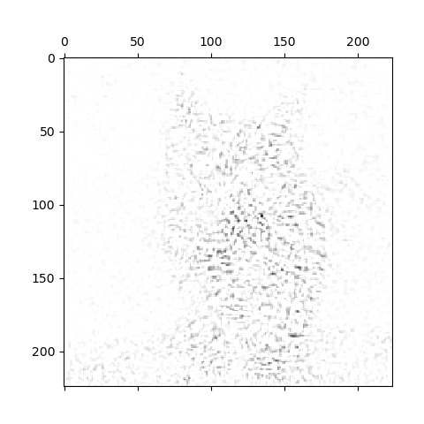

论文[Axiomatic Attribution for Deep Networks](https://arxiv.org/abs/1703.01365)阅读笔记，主要内容涉及网络输出和输入特征归因（attribution）的两个公理和integrate gradients方法，包含补充的命题证明。

<!--more-->

---
##  1. Motivation and Summary of Results

对于问题的定义：
>$\textbf{Definition 1.}$ Formally, suppose we have a function $F:\mathbb{R}^n\to [0,1]$ that represents a deep network, and an input $x=(x_1,\cdots,x_n)\in \mathbb{R}^n$. An attribution of the prediction at input x relative to a baseline input $x_0$ is a vector $A_F(x,x_0)=(a_1,\cdots,a_n)\in \mathbb{R}^n$ where $a_i$ is the contribution of $x_i$ to the prediction $F(x)$.

即，对于一个从$R^n$到实数域的映射，在$R^n$找到一个向量$a$作为输入向量$x$的归因（attribution）。注意，在一个baseline的情况下，作者说明：
>$\textbf{Remark 1.}$ Let us briefly examine the need for the baseline in the definition of the attribution problem. A common way for humans to perform attribution relies on counterfactual intuition. When we assign blame to a certain cause we implicitly consider the absence of the cause as a baseline for comparing outcomes. In a deep network, we model the absence using a single baseline input. For most deep networks, a natural baseline exists in the input space where the prediction is neutral. For instance, in object recognition networks, it is the black image. The need for a baseline has also been pointed out by prior work on attribution (Shrikumar et al., 2016; Binder et al., 2016).

即baseline是必要的，它总是显式地或隐式地出现。

## 2. Two Fundamental Axioms
下面提出上文定义的归因问题，其归因方法需要满足的两条公理。

### 2.1. Axiom: Sensitivity(a)
>An attribution method satisfies Sensitivity(a) if for every input and baseline that differ in one feature but have different predictions then the differing feature should be given a non-zero attribution.

即输入和baseline在某个特征不同时，且输出不同，则该特征应该有一个非零的归因。

例如，基于ReLU的梯度的方法使用梯度乘特征来作为该特征的归因，会违反此公理。例如$y=1-ReLU(1-x)$，在$x>1$时，梯度为零，则归因（因为有梯度作为因子）为零，而在0和2时，输出为0和1；再如基于BP的方法，如DeConvNets、Guided BP，和基于梯度的方法类似，由于ReLU的存在使得不满足sensitivity。

### 2.2. Axiom: Implementation Invariance
>Two networks are functionally equivalent if their outputs are equal for all inputs, despite having very different implementations. Attribution methods should satisfy Implementation Invariance, i.e., the attributions are always identical for two functionally equivalent networks.

即归因只和模型输入输出的函数相关，不应由实现的差异而不同。

例如，某些模型架构，可能存在参数和函数非单射的情况，导致因为初始化或其他情况下，同一个函数有不同的参数，则归因方法不应该由于参数不同而归因结果不同。如LRP、DeepLIFT方法。

*注：作者这个implementation invariance应该是指，如果两个模型实际是同一个映射（输入输出对应关系相同），那么解释应该一样，例如，使用梯度（输出直接对输入求导）作为解释是满足的（因为直接对函数求导）。作者可能主要是想要排除一种情况：比如同一个映射的两个模型，根据链式方法乘起来结果（输出对输入的梯度）是一样的，但是中间的状态不一样（链式法则相乘的项数个数、值），如果用中间的状态解释，使用了这些不同的中间项，可能会导致解释不同。*

## 3. Our Method: Integrated Gradients
在$\mathbb{R}^n$中，考虑baseline输入$x'$和输入$x$之间直线路径，对函数（模型）$F$其路径上的梯度积分，定义输入$x$在$i$维度上的integratedGrads如下：

$$integratedGrads_i(x)::=(x_i-x'_i)\int_0^1\frac{\partial F(x'+\alpha(x-x'))}{\partial x_i}d\alpha \tag{1}$$

### Axiom: Completeness
>Integrated gradients satisfy an axiom called completeness that the attributions add up to the difference between the output of $F$ at the input $x$ and the baseline $x_0$

即所有的归因值加起来等于输入和baseline输入的输出之差。

对于文中定义的integratedGrads，满足completeness：
>$\textbf{Proposition 1.}$ If $F:\mathbb{R}^n\to\mathbb{R}$ is differentiable almost everywhere then:
>$\sum^n_1 integratedGrads_i(x)=F(x)-F(x_0)$

神经网络由有限个不可微点的函数复合而成，是几乎处处可微的实函数。

定义$\gamma=(\gamma_1,\cdots,\gamma_n): [0,1]\to\mathbb{R}^n$为一路径，在这里$\gamma(\alpha)=(\gamma_1(\alpha),\cdots,\gamma_n(\alpha))=x'+\alpha(x-x')$，于是由链式法则有:

$$\begin{aligned}
    \sum^n_1 integratedGrads_i(x) 
    &=\sum^n_1(\gamma_i(1)-\gamma_i(0))\int_0^1\frac{\partial F(\gamma)}{\partial \gamma_i}d\alpha \\ 
    &=\sum^n_1\int_0^1\frac{\partial F(\gamma)}{\partial \gamma_i}\frac{\partial \gamma_i}{\partial \alpha}d\alpha \\ 
    &=\int_0^1\frac{\partial F(\gamma)}{\partial \gamma}\cdot\frac{\partial \gamma}{\partial \alpha}d\alpha \\
    &=\int_0^1\frac{\partial F(\gamma)}{\partial \alpha}d\alpha \\
    &=F(\gamma(1))-F(\gamma(0))=F(x)-F(x')
\end{aligned} \tag{2}$$

对于模型，baseline一般要求其$F(x_0)\approx 0$，这样更为方便。

>$\textbf{Remark 2.}$ Integrated gradients satisfies Sensivity(a) because Completeness implies Sensivity(a) and is thus a strengthening of the Sensitivity(a) axiom. This is because Sensitivity(a) refers to a case where the baseline and the input differ only in one variable, for which Completeness asserts that the difference in the two output values is equal to the attribution to this variable. Attributions generated by integrated gradients satisfy Implementation Invariance since they are based only on the gradients of the function represented by the network.

即completeness成立是sensitivity成立的充分条件，因为式1有：

$$\begin{aligned}
    integratedGrads_i(x) 
    &=(\gamma_i(1)-\gamma_i(0))\int_0^1\frac{\partial F(\gamma)}{\partial \gamma_i}d\alpha \\ 
    &=\int_0^1\frac{\partial F(\gamma)}{\partial \gamma_i}\frac{\partial \gamma_i}{\partial \alpha}d\alpha \\ 
    &=\int_0^1\frac{\partial F(\gamma(\gamma_i))}{\partial\alpha} d\alpha \\
    &=F(\gamma(\gamma_i(1)))-F(\gamma(\gamma_i(0)))
\end{aligned} \tag{3}$$

当$x$和$x'$只有$i$维度不同时，则有$F(\gamma(\gamma_i(1)))-F(\gamma(\gamma_i(0)))=F(\gamma(1))-F(\gamma(0))=F(x)-F(x')$，所以sensitivity成立。

integratedGrads归因方法满足Implementation Invariance，因为其只和函数的梯度相关。

## 4. Uniqueness of Integrated Gradients
指出对归因方法经验性的评价方法，无法区分数据、模型和归因方法的影响，所以作者提出公理性的方法来解决此问题；再指出只有Path method的唯一性，且由于对称性，integrate gradients方法是最准确（canonical）的方法。

### 4.1. Path Methods
指出一般的Path Method，及其PathIntegratedGrads定义：
>Given a path function $\gamma$, path integrated gradients are obtained by integrating the gradients along the path $\gamma(\alpha)$ for $\alpha \in [0,1]$. Formally, path integrated gradients along the $i$th dimension for an input $x$ is defined as follows: 

>$PathIntegratedGrads\gamma_i(x)::=\int_0^1\frac{\partial F(\gamma(\alpha))}{\partial\gamma_i(\alpha)}\frac{\partial\gamma_i(\alpha)}{\partial\alpha}d\alpha$, where $\frac{\partial F(\gamma(\alpha))}{\partial\gamma_i(\alpha)}$ is the gradient of F along the $i$th dimension at $x$.

也满足两条公理：
>$\textbf{Remark 3.}$ All path methods satisfy Implementation Invariance. This follows from the fact that they are defined using the underlying gradients, which do not depend on the implementation. They also satisfy Completeness (the proof is similar to that of Proposition 1) and Sensitvity(a) which is implied by Completeness (see Remark 2).

证明见上一部分。

再补充规定，不依赖的变量，其归因应该为零（是implementation invariance的充分条件）：
>$\textbf{Axiom: Sensitivity(b).}$ (called Dummy in [(Friedman, 2004)](https://link.springer.com/article/10.1007%2Fs001820400173)) If the function implemented by the deep network does not depend (mathematically) on some variable, then the attribution to that variable is always zero.

规定线性性：
>$\textbf{Axiom: Linearity.}$ Suppose that we linearly composed two deep networks modeled by the functions f1 and f2 to form a third network that models the function a×f1+b×f2, i.e., a linear combination of the two networks. Then we’d like the attributions for a × f1 + b × f2 to be the weighted sum of the attributions for f1 and f2 with weights a and b respectively. Intuitively, we would like the attributions to preserve any linearity within the network.

满足上诉sensitivity、implementation invariance、completeness、linearity，Path Method是唯一的方法：
>$\textbf{Proposition 2.}$ (Theorem 1 [(Friedman, 2004)](https://link.springer.com/article/10.1007%2Fs001820400173)) Path methods are the only attribution methods that always satisfy Implementation Invariance, Sensitivity(b), Linearity, and Completeness.

### 4.2. Integrated Gradients is Symmetry-Preserving
定义对称性：
>$\textbf{Symmetry-Preserving.}$ Two input variables are symmetric $w.r.t.$ a function if swapping them does not change the function. For instance, $x$ and $y$ are symmetric $w.r.t.$ F if and only if $F(x, y) = F(y, x)$ for all values of $x$ and $y$. An attribution method is symmetry preserving, if for all inputs that have identical values for symmetric variables and baselines that have identical values for symmetric variables, the symmetric variables receive identical attributions.

说明IntegrateGradients满足对称性：
>$\textbf{Theorem 1.}$ Integrated gradients is the unique path method that is symmetry-preserving.

## 5. Applying Integrated Gradients
近似计算的方法：

$$IntegratedGrads^{approx}_i(x)::=(x_i-x'_i)\times\sum^m_{k=1}\frac{\partial F(x'+\frac{k}{m}\times(x-x'))}{x_i}\times\frac{1}{m}$$

实验证明一般m在20和300之间。

## 实验
代码如下：
```python
import numpy as np
import tensorflow as tf
from keras import backend as K
from keras import activations

def normalize(array):
    arr_min = np.min(array)
    arr_max = np.max(array)
    return (array - arr_min) / (arr_max - arr_min + K.epsilon())

def linearize_activation(model, custom_objects=None):
    model.layers[-1].activation = activations.linear
    return model

def compute_gradient(model, output_index, input_image):
    input_tensor = model.input
    output_tensor = model.output

    loss_fn = output_tensor[:, output_index]

    grad_fn = K.gradients(loss_fn, input_tensor)[0]

    compute_fn = K.function([input_tensor], [grad_fn])

    grads = compute_fn([input_image])[0]

    return grads

def int_visualize_saliency(model, output_index, input_image, custom_objects=None):
    model = linearize_activation(model, custom_objects)
    grads = compute_gradient(model, output_index, input_image)
    channel_idx = 1 if K.image_data_format() == 'channels_first' else -1

    attri = np.transpose(grads, (1, 2, 3, 0))
    attri = np.mean(attri, axis=3)              # 梯度平均值
    attri = attri * input_image[-1]             # 乘以x-x'，x'=0
    attri = np.sum(attri, axis=channel_idx)     # 把三个通道的值加起来
    attri = np.maximum(0, attri)                # 只显示正值
    
    return 1.0 - normalize(attri)

if __name__ == '__main__':
    from keras.applications import vgg16
    from keras.preprocessing.image import load_img
    from keras.preprocessing.image import img_to_array
    from keras.applications.imagenet_utils import decode_predictions
    import matplotlib.pyplot as plt

    filename = 'cat.jpg' #285
    n_intervals = 10

    original = load_img(filename, target_size=(224, 224))
    numpy_image = img_to_array(original)
    image_batch = np.expand_dims(numpy_image, axis=0)
    intervals = np.linspace(0, 1, n_intervals + 1)[1:].reshape((n_intervals, 1, 1, 1))
    image_batch = np.tile(image_batch, (n_intervals, 1, 1, 1)) * n_intervals
    processed_image = vgg16.preprocess_input(image_batch.copy())

    vgg_model = vgg16.VGG16(weights='imagenet')
    predictions = vgg_model.predict(processed_image)
    label_vgg = decode_predictions(predictions)
    print(label_vgg)

    saliency_map = int_visualize_saliency(vgg_model, 285, processed_image)
    plt.matshow(saliency_map, cmap='gray')
    plt.savefig('cat_saliency_map_int.png')
    plt.show()

```
在m=10时，分别是原图，gradients和integrated gradients方法：



