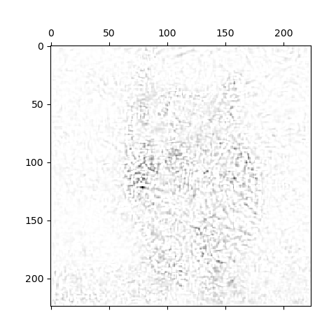
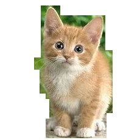
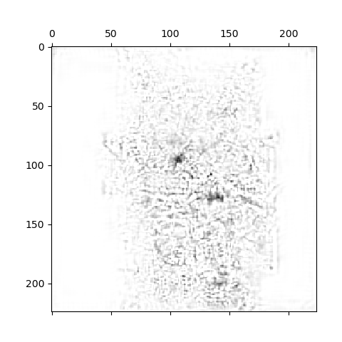

Simple Gradients based visualization。

<!--more-->

基于梯度的方法，做了仨事：
  1. Class Model Visualisation，一个优化问题：最大化目标标签的score，反向传播优化input image；
  2. Image-Specific Class Saliency Visualisation：提出通过目标标签的score（softmax前）在input image上的梯度，得出saliency map的可视化方法；
  3. Relation to Deconvolutional Networks：说明其generalize了deconv的可视化方法。


## Class Model Visualisation

有一个已经训练完成的模型，求解以下问题生成该类别的在该模型下的可视化图：

$$\mathop{\arg\min}\limits_I S_c(I)-\lambda||I||^2_2$$

其中$S_c(I)$表示input image在该model下的score（softmax前，以仅可视化目标类别的特征，而不抑制其余类别的特征）。

## Image-Specific Class Saliency Visualisation

在已有模型$S_c$的情况下，给定输入图像$I_0$，通过
$$\frac{\partial S_c}{\partial I}\bigg|_{I_0}$$
作为可视化结果。

可以将此可视化结果看作为非线性模型的线性近似，即在线性模型
$$y=w^Tx+b$$
下，$y$作为目标类别的score，$w$为权重（列向量），则可将$w$作为可视化结果，即对于x的saliency map。

将非线性模型$S_c$看作线性模型有：

$$S_c(I)\approx w^Tx+b$$

即对$S_c$做一阶展开。

### 类别特征图提取

对于灰度图，直接使用上述公式；若是三通道，则是使用$M_{i,j}=\max\limits_c relu(w_{i,j,c})$，因为saliency map是针对pixel而言，对于每个pixel的不同通道，其中的最大值表示该pixel的最大显著性。

### 实验

代码大改自https://github.com/ivanmontero/visualize-saliency，基于keras。

首先写几个操作组成：

导入库：
```python
import numpy as np
import tensorflow as tf
from keras import backend as K
from keras import activations
```

归一化：
```python
def normalize(array):
    arr_min = np.min(array)
    arr_max = np.max(array)
    return (array - arr_min) / (arr_max - arr_min + K.epsilon())
```

去除softmax层：
```python
def linearize_activation(model):
    model.layers[-1].activation = activations.linear
    return model
```

计算score相对于input image的梯度:
```python
def compute_gradient(model, output_index, input_image):
    input_tensor = model.input
    output_tensor = model.output

    loss_fn = output_tensor[:, output_index]

    grad_fn = K.gradients(loss_fn, input_tensor)[0]

    compute_fn = K.function([input_tensor],
                            [loss_fn, grad_fn])

    computed_values = compute_fn([input_image])
    loss, grads = computed_values
    print(loss, grads)

    return grads
```

生成可视化图，有个trick是由于grads太小，所以用1去减一下，可视化效果更好：
```python
def visualize_saliency(model, output_index, input_image, custom_objects=None):
    model = linearize_activation(model, custom_objects)
    grads = compute_gradient(model, output_index, input_image)
    channel_idx = 1 if K.image_data_format() == 'channels_first' else -1
    grads = np.maximum(0, grads)
    grads = np.max(grads, axis=channel_idx)
    
    grads = 1.0 - grads
    return normalize(grads)[0]
```

main函数：
```python
if __name__ == '__main__':
    from keras.applications import vgg16
    from keras.preprocessing.image import load_img
    from keras.preprocessing.image import img_to_array
    from keras.applications.imagenet_utils import decode_predictions
    import matplotlib.pyplot as plt

    filename = 'cat2.jpg' #285

    # 载入图像
    original = load_img(filename, target_size=(224, 224))
    numpy_image = img_to_array(original)
    image_batch = np.expand_dims(numpy_image, axis=0)
    processed_image = vgg16.preprocess_input(image_batch.copy())

    # 正向传播（仅作演示）
    vgg_model = vgg16.VGG16(weights='imagenet')
    predictions = vgg_model.predict(processed_image)
    label_vgg = decode_predictions(predictions)
    print(label_vgg)

    # 反向传播，生成saliency map
    saliency_map = visualize_saliency(vgg_model, 285, processed_image)
    plt.matshow(saliency_map, cmap='gray')
    plt.savefig('cat_saliency_map.png')
    plt.show()
```

最后得到的效果如下：




## Relation to Deconvolutional Networks

用$X_n$表示一网络的第$n$层正向传播时的输出，用$R_n$表示一卷积网络的反卷积网络的第n层（正向来看的序数）输出，有如下关系：

1. 对于卷积层，第n的梯度为$\frac{\partial f}{\partial X_n}=\frac{\partial f}{\partial X_{n+1}}\star \hat{K_n}$即$=R_n=R_{n+1}\star R_n$，即与deconv网络等价；
2. 对于ReLU层，反向传播时，第n层梯度$\frac{\partial f}{\partial X_n}=\frac{\partial f}{\partial X_n}\cdot\mathbb{1}(X_{n+1}>0)$；而deconv网络为$R_n=R_{n+1}\cdot \mathbb{1}(R_{n+1})$。一个要求正向传播的特征大于零，另一则是梯度大于零。
3. 对于池化层，由于deconv的switch的存在，所以等价。

然后作者说，除了ReLU，其余等价，且由于本文可以处理dense层，所以更general：

>We can conclude that apart from the RELU layer, computing the approximate feature map reconstruction Rn using a DeconvNet is equivalent to computing the derivative ∂f /∂Xn using backpropagation, which is a part of our visualisation algorithms. Thus, gradient-based visualisation can be seen as the generalisation of that of [13], since the gradient-based techniques can be applied to the visualisation of activities in any layer, not just a convolutional one. In particular, in this paper we visualised the class score neurons in the final fully-connected layer.

## 笔记总结

对grad-cam中噪声的成因感兴趣，应该是由于背景信息中存在相似的pattern使得卷积核会提取到一点特征，如下面的显著图：




白色背景的显著图无噪声。


