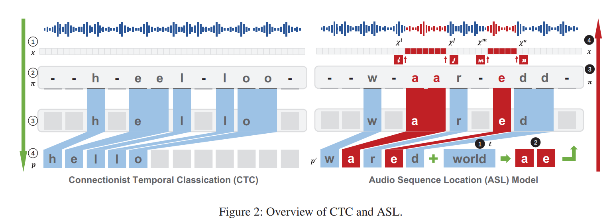

论文发表在[AAAI 2020](https://arxiv.org/abs/1901.10300)阅读笔记，暂时没有官方的代码。

论文主要提出了SPT(Sampling Perturbation Technology)和WPT(Weighted Perturbation Technology)两种方法，使得生成的音频对抗样本更低噪声、鲁棒、快速生成（分钟级）。

<!--more-->

没有复现和实验（没找到作者的代码），属于纸上谈兵。

## Introduction

生成音频对抗样本的三大困难：

- 计算资源多、计算时间长，花费时间以小时计；
- 录音再重放会引入噪声，现有方法生成的对抗样本鲁棒性不强；
- 适合作为音频对抗样本loss函数的度量方法，缺乏研究（图像一般用lp范数）

作者的工作：

- 使用SPT和WPT两种方法，控制扰动的样本点数量和更新权重，以提高鲁棒性和生成效率；
- 研究了loss函数使用不同度量方法的效果；
- 生成对抗样本只需4-5min（相较于以前的>1h）；

CTC介绍：https://distill.pub/2017/ctc/
样本：https://sites.google.com/view/audio-adversarial-examples/
代码：无

## Related Work

两种类型的攻击：

- speech-to-label：分类问题
- speech-to-text：语言转文字

论文讨论第二种，更具现实意义。

- [Carlini and Wagner 2018](https://ieeexplore.ieee.org/abstract/document/8424625)实现让ASR将一段话语识别为另一目标文字
- [CommanderSong](https://www.usenix.org/conference/usenixsecurity18/presentation/yuan-xuejing)实现在音乐中嵌入扰动，让ASR识别为目标文字，且是物理攻击

待优化方向：低噪声、鲁棒性、生成速度

## Background

威胁模型，攻击的目标ASR满足的条件：

- 核心构件是RNN
- 易被对抗样本攻击，攻击的结果作为下面测试的baseline
- 开源，以作白盒攻击

文章中的攻击：

- 威胁模型是：Deepspeech
- 只测试了白盒攻击

设$f$是ASR模型，$\delta$是添加的扰动，$x$是输入的语言，$t$是恶意信息（即攻击目标是使得$f(x+\delta)=t$），则语言对抗攻击的目标函数可以写为：

$$l(x,\delta,t)=l_{model}(f(x+\delta),t)+c\cdot l_{metric}(x,x+\delta)$$

其中，$l_{model}$是ASR训练时候的损失函数，常用CTC loss；而$l_{metric}$在论文中探讨了下面几种：

- SNR(Signal-to-Noise Ratio)，即$SNR=10log_{10}\frac{P_x}{P_{\delta} }=10log_{10}\frac{ |x|_2^2 }{ |\delta|_2^2 }$
- WER(Word Error Rate)，即$WER=\frac{N_{substitution}+N_{deletion}+N_{insertion} }{N_{all} }\times 100\%$
- Success Rate，即$Success Rate=\frac{N_{adv} }{N_{total} }\times 100\%$，其中$N_{adv}$是攻击成功的样本
- Robustness Rate，即$Robustness Rate=\frac{N_{t(adv)} }{N_{total} }\times 100\%$，其中$t$指添加噪声的映射，即添加噪声后的success rate

## Methodology

### Sampling perturbation technology

这里，以CTC loss为例：

- $x$是输入的语音（向量），$p$是$x$的语义信息（即phrase），$y$是概率分布（采用CTC的ASR的输出结果）
- $x_i$和$y^i$表示$x$的第$i$帧（向量值）及其概率分布（字符概率分布）
- $\pi$表示去除重复字符和空字符之前的tokens，有一个$\pi$，有其对应的text输出结果$p$，$\pi$的长度和$x$相同
- 有一个概率分布$y$，对应于不同的$\pi$，有这个$\pi$的概率值，这个值就是$\prod_i y^i_{\pi^i}$，即每帧$\pi^i$对应的概率相乘
- 有一个概率分布$y$，再有一个phrase记为$p$，则有一组$\pi\in\Pi(p,y)$
- 对于一个概率分布$y$，语义信息为$p$的概率为所有对应的tokens概率相加，即$Pr(p|y)\sum_{\pi\in\Pi(p,y)}\prod^n_{i=0}y^i_{\pi^i}$

以前的工作是通过扰动$\pi$每个位置上的值，来使得目标phrase的概率最大，在这里，固定一部分，扰动其余部分。

设被扰动后的tokens为$\pi'$，对应的概率分布为$y'$，则最大化下面这个式子：

$$\begin{aligned}
    t
    &=\text{argmax}_p Pr(p|y)\\ 
    &=\text{argmax}_p \sum_{\pi \in \Pi(p|y)}\prod_{i=0}^n y^i_{\pi^i}\\
    &=\text{argmax}_p \sum_{\pi'\in\Pi(p|y')}\prod_{j=0}^{n-m} y^j_{\pi^j} \prod_k^m y_{\pi'^k}^{'k}
\end{aligned}$$

（看起来是把$y$的前$n-m$个和$y'$的前$m$个直接乘起来？）没找到作者的代码。

### Weighted perturbation technology

实验发现，在将语音原来的phrase调整到目标phrase的时候，超过一半的时候花在了两者Levenshtein距离在3-0的时候。

使用ASL(Audio Sequence Location)模型去寻找目前结果的phrase和target phrase之间的区别，给出tokens中$k$个关键的key tokens（改变这些token使得输出为target phrase）$\chi^k$，然后在这个集合中的token，给予大于1的权重。

$$l(x,\delta,t)=l_{model}(f(x+\alpha\cdot t),t)+c\cdot l_{metric}(x,x+\delta)$$

$$\alpha_i=\begin{cases}
    \omega,if i\in \chi^k,\omega>1\\
    1,else
\end{cases}$$

同时在levenshtein距离从1到0的时候，降低learning rate。

