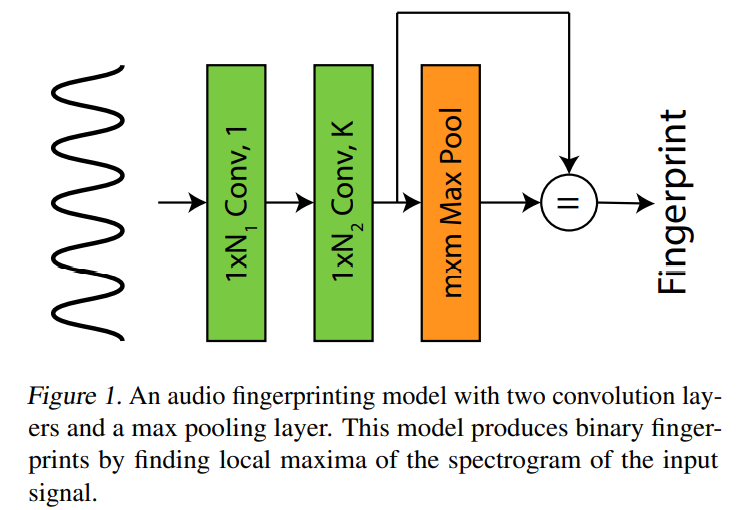
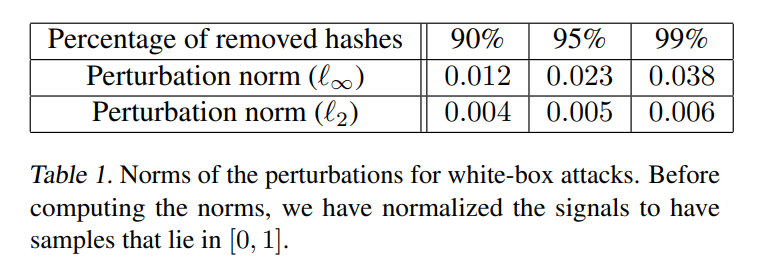
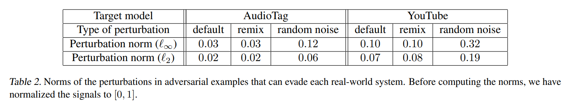

论文[Adversarial Attacks on Copyright Detection Systems, ICML 2020](http://proceedings.mlr.press/v119/saadatpanah20a.html)阅读笔记。

使用音频对抗攻击的思路和方法，论文攻击了版权检测（Copyright Detection）系统。作者首先使用神经网络去还原了一个公开的音频指纹（Audio Fingerprint Models）提取算法，然后使用常规的对抗攻击算法攻击了这个模型（白盒），然后在放大（scale up）了一些扰动之后，黑盒攻击了谷歌的AudioTag版权检测系统和YouTube的Content ID系统。

<!--more-->

本人没有复现和做实验，属于纸上谈兵。

## Introduction

这里省略对抗样本的基本介绍。

下面是有关copyright detection的一些背景信息：

- 版权检测一般的方法是通过提取音频或视频的特征（指纹，fingerprint），然后与已有的特征库做对比，判断是否侵权。
- YouTube的Content ID系统，将对每个视频做标记（flag），方便管理。
- Google Jigsaw会检测并移除宣扬（promote）恐怖主义和危害（jeopardize）国家安全的视频。
- 欧盟要求所有能够使得用户上传文字、音频和视频的服务都要有版权过滤（copyright filter）。

版权检测系统通常是专利（proprietary），无法攻击全部的系统。论文的目标在于

- 证明版权检测系统的脆弱性
- 确定（establish）现有文献中的攻击能够潜在地利用（exploit）音视频版权检测系统。

论文的工作：

- 攻击音频版权检测系统；
- 使用tensorflow复现了“shazam”算法（音频指纹提取），使得算法成为一个可微的神经网络；
- 使用基于梯度的方法，白盒和黑盒攻击；
- 黑盒攻击：足够扰动的情况下，攻击了现有的工业系统AudioTag和YouTube Content ID系统

主页和样例：https://www.cs.umd.edu/~tomg/projects/copyrightattack/

可以听出，黑盒攻击AudioTag和Content ID的音乐噪音还是明显的。

##  What makes copyright detection systems vulnerable to attacks?

这里省略一般的对抗样本工作的介绍。

版权检测系统的攻击和一般的（图片、音频）对抗攻击的区别：
- 数字域的攻击：版权检测面对的数字媒体一般直接上传到服务系统（如YouTube），而不是在物理世界采样得到（如针对stop sign的攻击，需要对干扰因素鲁棒（nuisance variables）），这使得版权检测的攻击更为简单（相比较物理攻击）；
- 开集问题：闭集问题（closed-set）的每个输入有个确定的类别与之对应，版权检测是开集（open-set）问题，大多数音频不侵权，需要被标记，系统往往采取保守的策略；
- 高相似度下的判别：版权检测系统在具有高相似度（共享许多特征）的音频中分辨出音频是否侵权（类似于ImageNet在高相似度的图片中分类），对于对抗攻击（只需要改动更少的特征）而言，较为有利。

上面三点，使得版权检测系统易于攻击。

## Types of copyright detection systems

版权检测系统通过提取图片、音频、视频的特征（指纹），然后与已有的特征库作比较，如果达到一定的相似度，就视为侵权（两样本相同）。提取特征的方法有两种：

- 使用一个神经网络提取特征
- 使用手动构造（hand-crafted）的特征，也可以重新解释（reinterpret）成一个神经网络

论文断言，手动构造的音频特征并不安全。

## Case study: evading audio fingerprinting

下面使用神经网络还原（resemble）了一个常用的公开的音频指纹提取算法，然后进行白盒攻击，并迁移到了黑盒上（AudioTag，YouTube Content ID）。

###  Audio fingerprinting models

攻击的算法是[shazam算法](https://citeseerx.ist.psu.edu/viewdoc/download?doi=10.1.1.217.8882&rep=rep1&type=pdf)，广泛用于音乐识别。

良好的音频指纹具有的三个性质：

1. 时间局部性（Temporally Localized）：使用音频的一小段区间计算得到
2. 平移不变性（Translation Invariant）：音频样本起始时间不同，但是指纹相同
3. 鲁棒性：对一定的噪声鲁棒

shazam使用时频图峰（spectrogram peaks）的位置（针对每一时间帧而言）作为音频的指纹，对噪声鲁棒，并近似线性超稳定型（approximate linear superposability）。

### Interpreting the fingerprint extractor as a CNN

可以将上述提取特征的算法看作一组变换（线性映射），参考上面所说的前俩性质，使用CNN来还原shazam算法，有下面几层：

第一层，hann窗。和标准化（hann系数加起来等于1）的hann函数做卷积，卷积核如下：

$$f_1(n)=\frac{sin^2(\frac{\pi n}{N})}{\sum^N_{i=0}sin^2(\frac{\pi i}{N})}$$

- 减轻不连续和不好的频谱性质（如旁瓣现象）对生成对抗样本的影响
- 对黑盒攻击施加更加有效的扰动

第二层，短时傅里叶变化，计算时频图。和N个Fourier核做卷积，代表不同的频率：

$$f_2(k,n)=e^{-i2\pi kn / N},k\in\{0,1,\cdots,N-1\}$$

- 然后取其幅度谱即可（即模长）。
- 设输入信号为$x$，定义此时得到的特征为$\phi(x)$

然后使用maxpooling来提取局部最大值（沿着频率方向，即对频率特征进行一维池化），然后使用最大值的位置作为指纹，即如下的等式：

$$\phi(x)=maxpool(\phi(x))$$

>The resulting binary map of local maxima locations is the fingerprint of the signal and can be used to search for a signal against a database of previously processed signals. 

记这个二进制指纹为$\psi(x)$。

### Formulating the adversarial loss function

对抗样本的损失函数怎么设计？如何衡量两个指纹的相似性？

论文使用Lp范数，具体而言使用$l_{\infty}$来限制扰动的强度，使得：

$$|\delta|_{\infty}\le \epsilon$$

参考hamming距离（二进制位数不同的个数）来衡量两个二进制指纹的相似性，使用下面的式子作为两个指纹（adversarial&original，设为$x$和$y$）的相似度损失：

$$J(x,y)=|\phi(x) \cdot \psi(x) \cdot \psi(y)|$$

- 即只有$x,y$共同的最大值位置的值相加，只利用这些地方的神经元。

- 对于白盒攻击，目前设计的损失是足够的，但是对于黑盒攻击，不够鲁棒。针对某一时间帧，只需要对抗样本的频峰（peaks）向高/低频移动一个单位就可以使得该频峰对loss的贡献为零。

因此，论文采取了下面的loss函数，来使得对抗音频的peaks离真（original）样本的peaks更远。

$$J(x,y)=\sum_i(ReLU(c-(max_{|j\le w_1|}\phi(i+j;x)-max_{|j\le w_2|}\phi(i+j;x)))\cdot \psi(i;y))$$

记相减项为$\Delta$。
$\Delta = max_{|j\le w_1|}\phi(i+j;x)-max_{|j\le w_2|}\phi(i+j;x)\ge 0$

- 式子是针对某一时间帧而言的。
- （可以看作）这里有两个最大池化层，池化宽度分别为$w_1,w_2$且$w_1\ge w_2$，这使得$\Delta$值非负，其中$c$为常数，控制扰动的幅度。
- 在上式中，如果$i$位置对抗样本的peak存在于$w_2$宽度内，则$\Delta=0$；否则，存在于$w_2$之外，$w_1$之内，则$\Delta>0$。这使得最大值倾向于出现在离原样本peak较远的位置，更为鲁棒。

论文使用了下面的[smoothed max function](https://en.wikipedia.org/wiki/Smooth_maximum)来代替实际的max函数：

$$S_{\alpha}=\frac{\sum^n_{i=1}x_i e^{\alpha x_i}}{\sum^n_{i=1} e^{\alpha x_i}}$$

- $\alpha\to\infty$，该函数逼近真实max函数。
- 论文说是为了使max可微？但是maxpooling是可以进行反向传播的。这里应该是为了使得生成的对抗样本更为鲁棒，因为smoothed版本能够考虑到除了最大值神经元之外的神经元（重要性依值大小而定），更具有抗干扰的能力（加了噪声之后？）。
- 论文中的$\alpha$一直取1.

### Crafting the evasion attack

求解的优化问题如下：

$$min_{\delta} J(x+\delta,x) \qquad s.t.|\delta|_{\infty} \le \epsilon$$

用PGD生成，Adam优化器。

###  Remix adversarial examples

上式生成的对抗样本噪声不自然，论文添加了下面的损失，使得生成的对抗样本的指纹和另一目标音频的指纹相似，即听起来更像是这个目标音频。

$$J_{remix}(x,y)=\sum_i(ReLU(c-(max_{|j\le w_2|}\phi(i+j;x)-max_{|j\le w_1|}\phi(i+j;x)))\cdot \psi(i;y))$$

$J_{remix}$和$J$的区别在于$w_1,w_2$的顺序不同，这使得让loss趋于最小值的方向相反，即使得生成的对抗样本的peak位置倾向于在$w_2$之内，即让对抗音频$x$的peak和目标音频$y$的peak贴近一点。

生成remix版本样本的优化问题如下：

$$min_{\delta} J(x+\delta,x) + \lambda J_{remix}(x+\delta,y) \qquad s.t.|\delta|_{\infty} \le \epsilon$$

$\lambda$是控制remix强度的参数。

##  Evaluating transfer attacks on industrial systems

- 攻击了两个工业系统
- remix和无remix版本的对抗样本
- 30s长度的音频
- 样本：https://www.cs.umd.edu/~tomg/projects/copyrightattack/

### White-box attack results

使用hamming距离思想的loss函数，在人不可察觉的情况下攻击成功情况如下：

### Transfer attacks on AudioTag

[AudioTag](https://audiotag.info/)能够对上传的音频进行比对，然后找出这个音频是什么歌曲。

- 成功攻击，扰动不易被人察觉
- 可能架构与shazam类似
- 数据集中90%的歌曲在表中扰动强度的情况下攻击成功
- 4倍于扰动强度的随机噪声实现攻击

### YouTube

- 更难攻击，需要更大的扰动强度，扰动易察觉
- 3倍于扰动强度的随机噪声能实现攻击
- 数据集中67%歌曲攻击成功
