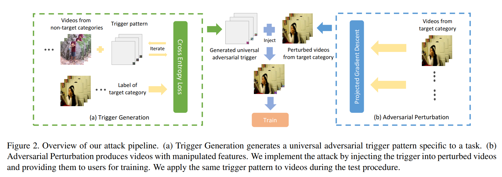

- 类型：后门攻击 （视频识别模型）> 数据投毒 > clean-label数据投毒
- 特点：视频识别模型的后门攻击

这篇CVPR2020的论文，貌似是少有的关于视频识别模型的后门攻击（TOP里我只找到这一篇）

<!--more-->

# Introduction

作者指出现有后门攻击应用到video情况下，可能会面临失败的四种情况：

1. 视频是3D，图像是2D（同意）
2. 视频分辨率更高，大多为224（勉强）
3. 更多的类别具有较少的样本，即sparse dataset的问题（勉强）
4. clean-label的场景（勉强）

作者是在与ICML19[1]上的一篇工作作比较，那个工作只在CIFAR-10上做了实验。

[1] Turner, Alexander, Dimitris Tsipras, and Aleksander Madry. "Clean-label backdoor attacks." (2018).

# Method

作者提出的是一种数据投毒的方法，即可以控制训练集一定比例的样本，但是不能修改这些样本的标签（clean label）。

如Figure 2所示，分为两个步骤，分别是触发器和对抗扰动的生成

- trigger generation
    - 目标的label是y，生成一个触发器t，使得非y的样本加上触发器后被分类为y
    - 从训练集中获得非y的样本集合S，利用模型F（该任务的一个clean-trained模型），类似于global adversarial patch的方法，生成一个全局的patch-based的扰动t；使得t附加到S中的样本上，都能被F识别为y
- adversarial perturbation
    - 获取标签为y的一定量的样本集合，利用这些样本生成对抗样本（non-target），使得模型F不将集合中的样本分类为y

可以看到，其中trigger generation生成的$\boldsymbol{t}$，拥有标签y的特征；而生成的adversarial perturbation的样本，不具有y的特征。因此，他们相加得到的下毒样本，使得模型在训练时，将会关注$\boldsymbol{t}$的特征，而不会关注之外的特征，使得其学习$\boldsymbol{t}$和标签y的关联。

换言之，虽然投毒样本并未改变正确的label，但是人眼看到的特征已经不被模型学习到（由于adversarial perturbation），模型学习到的是trigger的特征。

可以看出，该方法能起作用的一个假设就是：****************目标模型能学习到作为标签y的trigger中的特征。****************

trigger是通过clean-trained的模型逆向的，其中的特征也就是来自于这个clean-trained的模型；但是目标模型（victim）需要从头学习这个知识。

# Evaluation

Figure 3的右边的折线图可以看出，如果投毒率过高，那么模型无法学习到标签y应该有的特征，从而也就无法认为trigger的特征是标签y的特征，从而投毒失败。

# Discussion

backdoor攻击是要实现什么呢？也就是建立起x→ y的关联。从前的自然的想法是修改x的标签为y，自然可以让模型学习到这个映射。

这篇文章反过来证明了另外一种可能性，就是修改映射的源头，使得x实际上就是标签y的特征，但是不被人察觉。所以更像是一种对抗攻击，只不过是发生在模型训练阶段，而不是测试阶段。