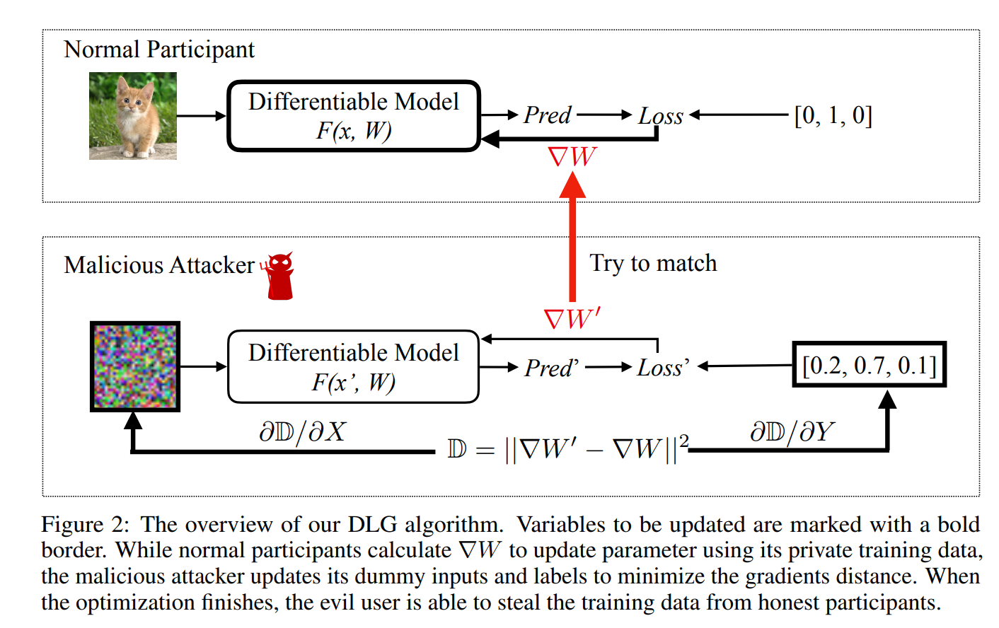

原文发表在[NeurIPS, 19](https://papers.nips.cc/paper/2019/file/60a6c4002cc7b29142def8871531281a-Paper.pdf)，代码：[Github](https://github.com/mit-han-lab/dlg)

<!--more-->

## 引言

### 问题是什么？

在训练过程中，能否通过模型更新的梯度恢复出此次batch的训练数据？

具体而言：

- 场景：在训练过程中，现有模型：$F(x;W)$，其权重为$W$，已知梯度$\Delta W=\frac{\partial loss(X)}{\partial W}$，求输入$X$？
- 攻击者能力：攻击者除了输入及输出不知道，梯度$\Delta W$和算法、结构、当前的权重$W$都知道

### 背景意义

在协同学习，包括联邦学习场景下，为了避免训练集泄露，同时又为了利用所有参与者的私有数据集来训练一个模型，参与方通常需要分享自己的梯度（无论是分享给中心化学习的中心，还是分布式学习中的一方），而不是直接分享自己的数据。

因此，论文的工作在于证明，梯度也可以泄露隐私信息。

### 论文工作Overview

- 论文思路非常简单：直接暴力优化去找输入，使得这个输入反向传播得到的梯度和$\Delta W$相等（接近）。
- 在CIFAR数据集上，使用简单的模型结构，攻击效果和效率还是不错的

## 方法

实际上，就是求解下面这个优化问题：

$$X'^{*},y'^{*}=\text{argmin}_{X',y'}|\frac{\partial loss(F(X';W),y')}{\partial  W}-\Delta W|^2$$

先随机化一个输入及其标签，然后不断迭代优化。

值得注意的是，作者使用的是L-BFGS算法，而不是一般的梯度下降。

同时，可以看出，这个问题求解需要$F$对于$W$二阶可微，对于广大ReLU激活的神经网络，很不友好喔。

## 结果

### 实验准备

作者在论文中主要做了两个实验，一个图像，一个文本。这里主要讨论图像，以CIFAR-100数据集为例。

作者使用，resnet-56模型，详细模型结构可以看代码。然后作者说为了使得模型可导，做了两个变化：

- ReLU替换为sigmoid
- stride设置为1

> Two changes we have made to the models are replacing activation ReLU to Sigmoid and removing strides, as our algorithm requires the model to be twice-differentiable.
> 

实际上，第二个操作是无必要的（怀疑是因为这样子效果更好作者才这样说）。

### 实验

作者的GitHub上，使用了一个LeNet模型，注意到：

- ReLU替换为sigmoid
- 没有MaxPool，而是将卷积的stride=2

如果将stride=2改成stride=1，然后换成MaxPool，则效果将会下降：

另外，实验时发现，将LBFGS的学习率设为小于1的值，才能好的效果。

## 讨论

### 防御方案

思路：减少攻击者可以得到的信息

- 对梯度加拉普拉斯、高斯噪声
- 梯度裁剪：将较小的、一定比例的值置为零
- Dropout：一定神经元比例停止工作，可以降低梯度中的信息量。具体见论文[[2108.11106v1] Dropout against Deep Leakage from Gradients (arxiv.org)](https://arxiv.org/abs/2108.11106v1)

## 评价

局限性较多：

- 神经网络必须二阶可导
- 图像分辨率大、网络复杂，则会导致优化困难

有意思的是，其证明了梯度中的信息，原则上是可以直接还原得到输入的信息的。
