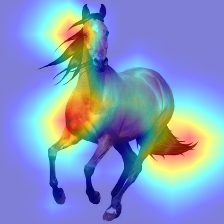
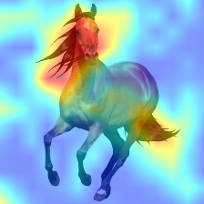

论文[Interpretable Explanations of Black Boxes by Meaningful Perturbation](https://arxiv.org/abs/1704.03296)阅读笔记，论文提出了一种optimization-based的可视化方法。

<!--more-->

##  Intro
优势在于方法本身的可解释性很强，缺陷在于optimization需要几百次的前向和反向传播。

## Method
Deletion Game，即删去输入尽量少的部分，同时降低尽量多的目标类别分数。

优化问题为：

$$min_{m\in[0,1]^\Lambda}\lambda_1||1-m||_1+\lambda_2\sum_{u\in\Lambda}||\Delta m(u)||^\beta_\beta+\mathbb{E}_\tau[f_c(\Phi(x_0(\cdot-\tau), M))]$$

即使得mask的1范数尽量低、生成的解释$e$（mask下的输入）的目标类别分数尽量低；同时满足图片的完全变分范数尽量低，即使得mask变化更为平缓；在迭代的过程中，还对输入加入了噪声。

初始化使用blur，相比noise和constant方法，能够缓解神经网络artifact的问题，比如blurred input和直接用0代替的结果如下：

后者（constant方法）更为弥散，收到伪影的影响。

## Code
见[GitHub](https://github.com/jacobgil/pytorch-explain-black-box).

## 后续
论文[Interpretable and Fine-Grained Visual Explanations for Convolutional Neural Networks](https://arxiv.org/abs/1908.02686)沿用了MASK的思路，在MASK原始Deletion Game的基础上，加入了Defending against Adversarial Evidence的思路，即使得解释$e$在每层的激活强度，都低于原图，以保证解释$e$具有的特征，原图一定具有。

不同于MASK，生成的解释是fine-grained的，因为去除了tv-norm。
