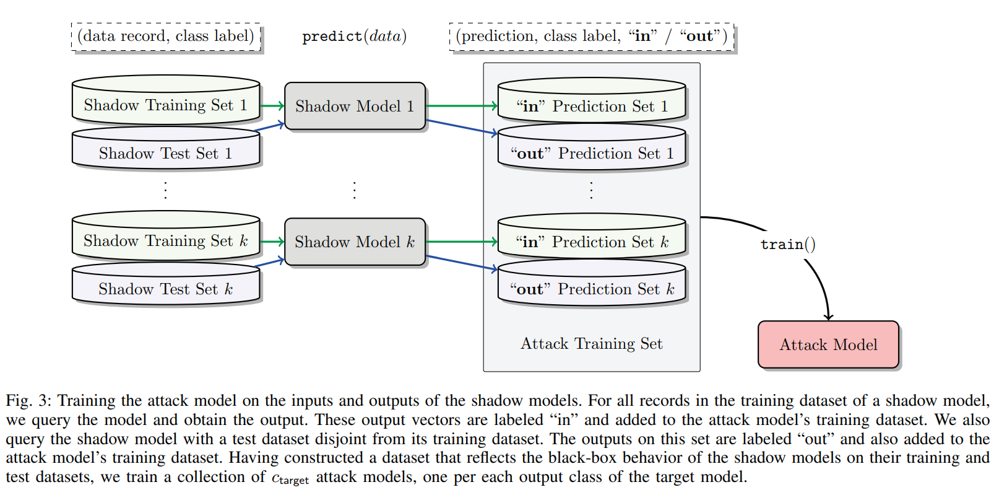
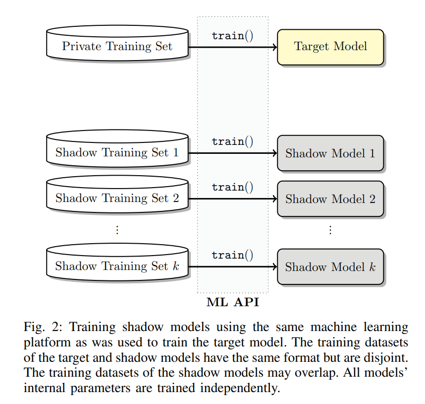
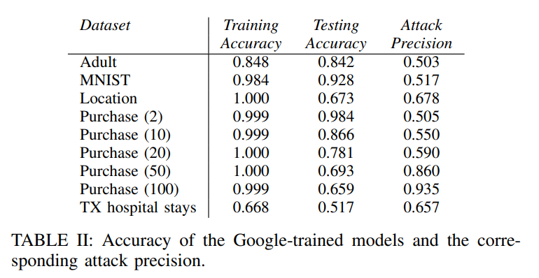

原文发表在[S&P, 2017](http://www.ieee-security.org/TC/SP2017/papers/313.pdf)；代码：[Github](https://github.com/AdrienBenamira/membership_inference_attack)

<!--more-->

## 引言

### 问题是什么？

在文章中，主要讨论的是如何解决这样一个问题：判断一条数据是不是在目标模型的训练集中？

具体说：

- 场景：现有一个模型$F:X\mapsto \hat{y}$，其中$X$是输入的数据（图片、病人的特征、用户的特征等等），假设是$C$个类别的分类问题，那么输出的向量$\hat{y}\in\mathbb{R}^C$，且$\hat{y}_i\in[0,1],\sum_{1}^C\hat{y}_i=1$，其实也就是softmax或者sigmoid的输出。
- 攻击者能力：可以以API的方式访问这个模型（目标模型作为黑盒存在），可以输入数据给模型，然后获得输出$\hat{y}$
- 攻击者目标：对于任意一条数据$(X,y)$（对于攻击者而言，其真实标签$y$是知道的），判断这条数据是不是在目标模型$F$的训练集中。

### 为什么是这个问题？

问题的实际意义在于，攻击者可以判断用户隐私是否被用于训练模型。**注意，其只是判断一条数据是不是在训练集中，而不是去窃取这条数据。**也就是说，攻击者是知道这条数据的，攻击者只是不知道这条数据是不是在训练集中。

这个攻击目标的实际意义如何，见仁见智了。

### 论文的Overview

论文思路：

- 数据驱动，设法训练一个二分类模型来预测数据是不是在训练集中
- 也就是，想办法模拟目标模型的行为，生成很多很多$\hat{y}$，多到可以训练一个二分类模型来预测数据在不在训练集中

论文结果：

- 效果比较好（在过拟合的情况下）

## 方法

对于攻击者来说，只能获知目标模型的输出。好消息是，不仅仅是预测的类别结果，而是一个表示概率分布的预测向量。

所以，充分利用模型输出的类别的概率分布（也就是$\hat{y}$）的信息。

### 方法思路

方法如下：

- 想办法得到和目标模型的训练尽可能一样的数据集（分为训练集和测试集），然后训练一堆影子模型(Shadow Model)
- 影子模型：尽可能和目标模型一样，训练方法、参数也尽可能像
- 然后用这些影子模型，分别输入训练集和测试集，得到大量的$\hat{y}$，组成攻击模型的训练集
- 用这个训练集去训练一个攻击模型（二分类任务）

具体而言，可以分为下面几个步骤：

### 数据集来源

理想情况是攻击者可以获得和目标模型训练集完全重合的数据集。

此阶段攻击者目标：获取数据集$\{X_1,X_2,\cdots\}$

实际上，在论文的实验中，其使用了四种来源的数据：

1. Model-based synthesis：攻击者通过反复调用目标模型的API，来生成一些数据，好奇具体算法可以参考原论文。论文中，对于[购物数据集](https://kaggle.com/c/acquire-valued-shoppers-challenge/data)，作者合成了30k数据，每条数据156次调用。
2. Statistics-based synthesis：攻击者知道输入数据$X$的一些统计特征。例如如果$X$代表病人的特征，攻击者知道特征的边界值，某些离散特征可能有几种取值。
3. Noisy real data：攻击者知道目标模型的训练集，但是是有噪声的版本。作者通过将$X$的一定比例的特征随机化，来模拟这种情况。例如，训练集样本所含特征的10%被随机化。
4. 作者直接使用了目标模型的数据集，但是和目标模型的训练集不相交。例如将CIFAR-100分为不相交的两部分，一部分给受害者用户，用来训练目标模型；然后另一部分给攻击者，攻击者用来训练影子模型然后训练攻击模型。

最后一种情况，是作者论文中大部分篇幅实验的数据来源。

而1-3种情况，攻击者的能力逐渐增强，从只能通过API合成数据，到可以直接获得数据（有噪声的）。

个人认为，也就1-2来源在现实中比较实际。

### 影子模型的设计和个数

理想情况是攻击者可以使用和目标模型一样的算法、结构、训练参数等等。

实际上，作者设想了两种情况：

- 攻击者已知目标模型的算法、结构
- 目标模型是在谷歌、亚马逊这些公司提供的云服务MLaaS上训练的；攻击者可以使用一样的MLaaS服务来训练影子模型。

第二种情况比第一种实际一些，论文中也主要针对MLaaS上训练的目标模型。

作者根据不同的数据集，使用了从10到100不同数目的影子模型。对于CIFAR图片分类，作者用了100个影子模型。

### 训练攻击模型

攻击者需要训练最终的攻击模型，流程如下：

- 对于每个影子模型的训练：攻击者将得到的数据$\{X_1,X_2,\cdots\}$分为训练集和测试集（对于不同影子模型，数据集可以相交）。
- 训练完成之后，分别将训练集和测试集输入影子模型，得到影子模型的预测向量$\hat{y}_{shadow}$。
- 测试集生成的预测向量，其标签就是out；训练集生成预测向量，其标签就是in。然后将这些数据（真实标签和影子模型的预测结果的组合，每一条数据都是$(y,\hat{y}_{shadow})$的样子，标签为in或者out）作为攻击模型的训练集。
- 所有影子模型最终会生成和$\{X_1,X_2,\cdots\}$个数一样多的攻击模型的训练集
- 训练攻击模型

攻击模型的结构由攻击者决定。论文中，作者简单使用一个全连接神经网络，甚至使用MLaaS服务来训练也行。

由上，最后得到一个执行二分类任务的攻击模型$f_{attack}:(y,\hat{y})\mapsto in/out$，输入数据$X$的真实标签、目标模型的预测向量，输出in或者out，代表其在不在目标模型训练集中。

## 结果

不详述，总之，效果挺好（目标模型过拟合了）。

作者用了很多图表来说明攻击效果如何好，详见论文。

这里就讨论一张表：

括号中代表epoch数，可以预料，越大，过拟合越严重。

而攻击精确度高的，都是过拟合严重（从training和testing的accuracy差别可以看出）的；如果过拟合不严重，攻击效果就不行。

## 讨论

### 过拟合越严重，攻击效果越好

论文作者强调，过拟合不是攻击效果好的唯一原因，其举出了相同train-test accuracy gap的情况下，Google的攻击效果更好来说明。

个人认为有一定道理，可能某些算法或网络结构，会导致其过拟合时，训练集、测试集输出的概率分布特征差别比其他算法大。

不过这并不能掩盖过拟合是导致攻击成功的重要因素这一事实。

### 防御

作者给出了一些方法来防御，大体是两个思路：

- 减少攻击者可知的信息：目标模型不直接返回$\hat{y}$，而是top-k的$\hat{y}$，或者干脆只返回类别标签。
- 减轻过拟合：谷歌等云服务平台，有必要提醒用户过拟合的安全风险，并设法避免过拟合。

## 评价

- 看起来，文章证明了：对于训练集和测试集，模型输出的$\hat{y}$具有不同的特征。实际上，前提基本是过拟合。
- 原以为比较理论，实际上比较工程的工作
- 实际上，个人感觉攻击场景比较受限，实际意义不大
- 数据获取场景，感觉也就Model-based synthesis和Statistics-based synthesis比较实际
- 作者使用的数据集是低分辨率的CIFAR，以及一些结构性的数据。如果数据本身复杂度高，那么攻击成本就比较大。例如，如果是高分辨率图像，那么实际场景中，要生成这些数据，就比较难

