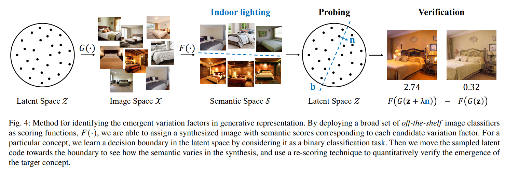

论文[Semantic Hierarchy Emerges in Deep Generative Representations for Scene Synthesis](https://arxiv.org/abs/1911.09267)阅读笔记。

对于场景(scene)生成，指出生成模型在生成图片过程中“语义层级”结构的存在，类似于TCAV的方法。

<!--more-->

本人没有复现，属于纸上谈兵。

## 核心思想

生成器是如下的函数，其中$\mathcal{Z},\mathcal{X}$分别是线性空间latent space和image space：

$$G:\mathcal{Z}\to \mathcal{X}$$

（某个variation factor的）分类器是如下函数，其中$\mathcal{S}$被称为semantic space，是实数域的子集：

$$F:\mathcal{X}\to \mathcal{S}$$

采样$A=\{z^1,\cdots,z^K\}\subset\mathcal{Z}\Longrightarrow$得到$F(G(A))\subset\mathbb{R}\Longrightarrow$找到$A_{F(G(A))>0}$和$A_{F(G(A))<0}$线性分类边界的单位法向量$n$。

可以使用该variation factor控制生成样本该语义的“含量”，进而再借用$F$采样量化该variation factor对目标模型分析的相关度:

$$\Delta s_i=\frac{1}{K}\sum^K_{k=1}max(F_i(G(z^k+\lambda n_i))-F_i(G(z^k)),0)$$

