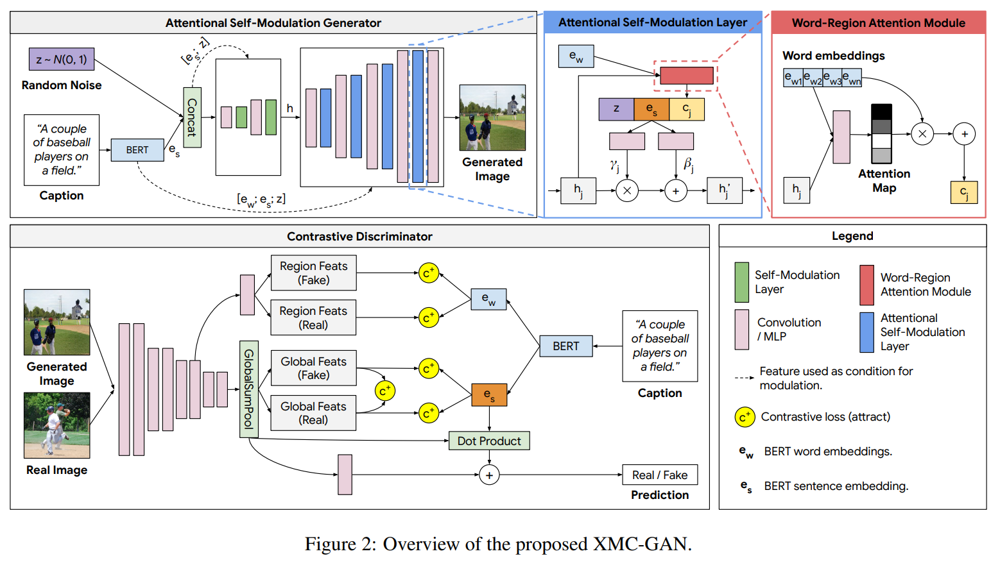

使用对比学习的思路，来做Text-to-Image任务，Google Research发表在[CVPR 2021](https://openaccess.thecvf.com/content/CVPR2021/papers/Zhang_Cross-Modal_Contrastive_Learning_for_Text-to-Image_Generation_CVPR_2021_paper.pdf)，官方代码在[xmcgan_image_generation](https://github.com/google-research/xmcgan_image_generation)， 但是作者没有公开预训练好的权重，甚至样本。。

<!--more-->

## Motivation：使用对比学习来做Text-to-Image

作者提出可以使用对比学习来完成Text-to-Image任务，直接使用one-stage的生成器，而不是通常的multi-stage的思路（将生成任务划分为几个子任务，如box-to-mask-to-image）。这使得，作者提到，目前的工作一方面仅针对特定域，例如针对鸟类，一方面也需要更细致化的标签来训练生成器，例如上面所说的box。而本文提出的方法，只需要Image和其对应的Text作为训练集。

论文方法的思路，主要沿着如何解决下面三个问题进行：

1. 生成的图像**整体上**需要和描述文本对应
2. 对于同样的描述文本，生成的图像需要和真实图像对应
3. 单个图像区域应该是可识别的并且与句子中的单词一致。

这里所说的“对应”即Image和Text在语义上，要合理地对应，要生成正确的图像内容。这三个问题实际上和作者提出的三个损失函数一一对应，应当结合下文理解。

## Method：三个对比损失和GAN

使用GAN作为基本的方法，同时作者使用对比学习的思路针对上面三个问题设计了三个损失函数，来设计、训练生成器和判别器。

下文先介绍作者提出的三个损失函数，损失函数主要牵扯到一幅图像和一段文本的度量。每个损失函数的计算都需要一对正确对应的样本$x_i$和$s_i$（称$s_i$为正样本），和$M$个和$x_i$无关的负样本$s_j$；每个损失函数也都需要一个score function。

在损失函数之后，介绍GAN的生成器和判别器。

### Image-text contrastive loss

针对第一个问题，给出Text和Image**整体上**的对比损失。

给定一个图像$x$和描述$s$，定义score function，其中cos指计算向量的余弦相似度，$\tau$是一个超参数（Temparature hyper-parameter）：

$$S_{sent}(x,s)=cos(f_{img}(x), f_{sent}(s))/\tau$$

其中$f_{img}$是一个图像的encoder，；而$f_{sent}$是文本的encoder。这两个编码器负责分别将文本和图像映射到**同一个**向量空间，下文中的编码器也是一样的功能。

可以看到，作者定义的这个函数也就是计算了图像$x$和描述$s$的相似度，如果是一个合理的对应文本-图像对，那么相似度应该大，而不合理对应的，函数给出的分数应该小。

然后，其对比损失即为：

$$\mathcal{L}_{sent}(x_i, s_i)=-\text{log}\frac{\text{exp}(S_{sent}(x_i, s_i))}{\sum^M_{j=1}\text{exp}(S_{sent}(x_i,s_j))}$$

如何理解这一称之为对比损失的函数？上面的两个编码器，将图像$x$和描述$s$都映射到了同一个向量空间的一个**球面**上（超球面），一个想要的结果是：$x$和正样本在球面上距离很近，而负样本和$x$距离较远。这也就是去最小化$\mathcal{L}_{sent}$，其分子和分母分别表示正样本和负样本与图像的相似度量。

### Contrastive loss between fake and real images with shared description

针对第二个问题，给出生成的图像和真实的图像的对比损失。

损失$\mathcal{L}_{sent}$无法保证生成器生成的图像有实际的意义。为了使得生成器生成具有实际且具有正确内容的图像，使用同样的思路，对比损失：

$$\mathcal{L}_{img}(x_i, G(z_i,s_i))=-\text{log}\frac{\text{exp}(S_{img}(x_i, G(z_i,s_i)))}{\sum^M_{j=1}\text{exp}(S_{img}(x_i,G(z_i,s_j)))}$$

其中$G$也就是生成器，而$S_{img}(x,x')=cos(f_{img}(x), f_{img}(x'))/\tau$，作为图像$x$和图像$x'$的score function。其与损失函数$\mathcal{L}_{sent}$思路一致，$\mathcal{L}_{sent}$负责度量文本和图像之间的对应关系，而$\mathcal{L}_{img}$度量图像和图像之间的对应关系，使得生成的图像接近真实的图像。

### Contrastive loss between image regions and words

针对第三个问题，给出图像区域和词之间的对比损失。这个损失是为了使得生成图像**其中的**内容能够和描述的词对应上，是进一步细致的要求。对比损失也是图像和文本之间的度量，为：

$$\mathcal{L}_{\text {word }}\left(x_{i}, s_{i}\right)=-\log \frac{\exp \left(\mathcal{S}_{\text {word }}\left(x_{i}, s_{i}\right)\right)}{\sum_{j=1}^{M} \exp \left(\mathcal{S}_{\text {word }}\left(x_{i}, s_{j}\right)\right)}$$

其中的score function如下，作者使用了soft attention来完成。即，针对每一个词$w_i$，计算其在每一个区域上的attention权重$\alpha_{i,j}$，然后得到这个词相应的对齐的区域特征（aligned region vector）也就是$c_i$。然后score function使用词$w_h$和$c_h$计算得到最后的分数。

$$\mathcal{S}_{\text {word}}(x, s)=\log \left(\sum_{h=1}^{T} \exp \left(\rho_{2} \cos \left(f_{\text {word}}\left(w_{h}\right), c_{h}\right)\right)\right)^{\frac{1}{\rho_{2}}} / \tau$$

$$c_i=\sum^R_{j=1}\alpha_{i,j} f_{region}(r_j)$$

$$\alpha_{i, j}=\frac{\exp \left(\rho_{1} \cos \left(f_{\text {word }}\left(w_{i}\right), f_{\text {region }}\left(r_{j}\right)\right)\right)}{\sum_{h=1}^{R} \exp \left(\rho_{1} \cos \left(f_{\text {word }}\left(w_{i}\right), f_{\text {region }}\left(r_{h}\right)\right)\right)}$$

其中$f_{word}$，$f_{region}$都是编码器，而$r_j$表示$x$不同的$R$个区域，$w_h$则分别是$s$个$R$个词。$\rho_1, \rho_2$是两个超参数，用以调节整个分布信息熵的大小，分析式子可以看出来，也就是，超参越大，而大者越大，小者越小。

### Attentional Self-Modulation Generator

生成器第一层的输入为高斯噪声，以及BERT输出的sentence embedding的拼接起来的向量。然后，作者还使用了BERT的word embeddings来改进了self-modulation。

self-modulation是对网络中Batch norm的一个改进，使得scale和shift的参数能够和输入相关，由某一个特定的模块计算得到，而不是作为独立于输入的参数存在（独立指，训练一旦结束，scale和shift的参数（即$\gamma$和$\beta$）就固定下来，对任何输入都一样）。这样，BN层就能根据不同的输入，动态地变动其scale和shift的强度。

作者使用word embeddings改进了self-modulation层，使得其不仅仅只和高斯噪声和sentence embedding相关。除了拼接噪声$z$和$e_s$，还有一个利用注意力机制计算出来的与$e_w$和当前层特征$h_j$有关的向量。

$$c_{j}=\sum_{i=1}^{T} \tilde{\alpha}_{j, i} e_{w_{i}}, \text { where } \tilde{\alpha}_{j, i}=\frac{\exp \left(\rho_{0} \cos \left(e_{w_{i}}, h_{j}\right)\right)}{\sum_{k=1}^{T} \exp \left(\rho_{0} \cos \left(e_{w_{k}}, h_{j}\right)\right)}$$

如示意图，最后将三个向量拼接起来，用全连接网络计算得到之后的特征$h'_j$：

$$h_{j}^{\prime}=\gamma_{j}\left(\text { concat }\left(z, e_{s}, c_{j}\right)\right) \odot \frac{h_{j}-\mu}{\sigma}+\beta_{j}\left(\operatorname{concat}\left(z, e_{s}, c_{j}\right)\right)$$

### Contrastive Discriminator

判别器一方面充当GAN中辨别图像真假的角色，一方面也要充当损失函数中图像的编码器，而文本的编码器，则分别使用BERT的sentence embedding和word embeddings作为整个句子和其中词的编码。如图，也就是说对于一张图像（real或fake），一方面是预测Real/Fake的分类损失，一方面是分别作为损失$\mathcal{L}_{sent}$和$\mathcal{L}_{word}$中图像的编码器（图中的Global/Region Feats），其中损失的计算分别需要和BERT的输出$e_s$、$e_w$计算点积。

训练判别器的图像编码器，只使用真实图像来训练，因为生成器可能生成不正确的（训练开始阶段，生成图像可能是无意义的）图像，影响编码器的训练；另外，作者在论文中说使用VGG网络来编码$\mathcal{L}_{img}$计算过程中的真实、生成的图像，不过在作者开源的代码里，默认用的是resnet50。

训练的算法如下，注意判别器和生成器的损失函数计算不同。

## Experiment Setup

### 数据集

作者使用的数据集包括：COCO-14、LN-COCO、LN-OpenImages。可以看出MS-COCO的文本较短，而后两者文本较长，难度更大。

### 评价指标

随机选择30000个captions生成图像，评估包括下面几个方面：

- Image quality：
    - Inception Score (IS)，基于inception v3输出的类别概率分布，值越大越好
    - Frechet Inception Distance (FID)，使用的是真实图像和生成图像在两个多元高斯分布之间的Frechet距离，值越小越好。
- Text-Image Alignment：
    - R-precision：作者使用的编码器是在额外的数据集上训练的
    - Semantic Object Accuracy (SOA)：包括SOA-C和SOA-I
- Human evaluation：随机选择1000个captions生成对应图像，5个人打分。

## Results

### 评价指标结果

- Human evaluation：由图3看出，显示作者的方法最好
    
    
    
    
- COCO-14数据集上，在FID和R-precision两项指标上，作者方法获得了SOTA，但是在IS、SOA指标上，表现不如CP-GAN；而在LN-COCO、LN-OpenImage数据集上，作者除了SOA指标都获得了最好成绩。

IS和SOA指标侧重于衡量各个类别（例如，对于IS来说指InceptionV3模型的输出类别）之间的性能表现，而对于单个类别内的性能表现，该指标本身不够重视。

## 总结

作者提出使用对比学习来完成Text-to-Image任务，思路很清晰，使用对比学习来设计GAN的损失函数。论文内容可以总结为：分别使用编码器将图像和文本映射到一个超球面，分别通过三个损失函数，使得生产的图像和其输入的描述文本在球面上接近、和描述文本在真实世界中的图像接近，且生成的图像具有与文本词对应的内容。

