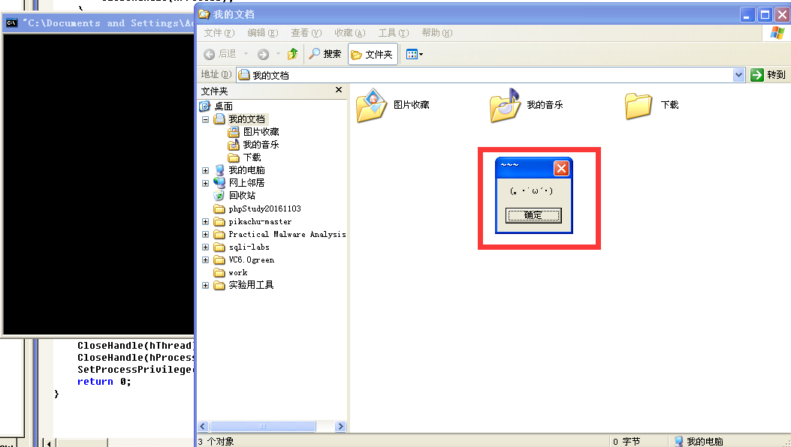

比较忙，更新个作业。

<!--more-->

# 基本思路

目标是：注入到explorer的进程空间，利用CreateProcess启动目标进程target.exe。

其中的基本步骤为：

1. 创建一个进程，打开explorer，涉及相关API：CreateProcess
2. 提取向其他进程空间写和执行的权限，涉及相关API：AdjustTokenPrivileges
3. 编写需要注入的代码和数据结构
4. 打开进程explorer，进入其内存空间分配内存、获取函数地址、写入代码和数据，然后执行，涉及到的API：OpenProcess、VirtualAllocEx、WriteProcessMemory、GetProcAddress、CreateRemoteThread。

# 核心代码

### 步骤1：打开explorer进程

使用CreateProcessA实现，传入命令，其中涉及到两个结构体，其中pi中dwProcessId即为进程ID，在后面注入时需要此信息。

```cpp
STARTUPINFO si;
PROCESS_INFORMATION pi;
ZeroMemory( &si, sizeof(si) );
si.cb = sizeof(si);
ZeroMemory( &pi, sizeof(pi) );
CreateProcessA(NULL, "explorer.exe", NULL, NULL, FALSE, 0, NULL, NULL, &si, &pi);
```

### 步骤2：Set Privilege

利用AdjustTokenPrivileges赋予本进程SE_PRIVILEGE_ENABLED的Debug权限，可以打开其他进程。

```cpp
BOOL SetProcessPrivilege(char *lpName, BOOL opt)
{
    HANDLE tokenhandle;
    TOKEN_PRIVILEGES NewState;

    if (OpenProcessToken(GetCurrentProcess(), TOKEN_ADJUST_PRIVILEGES | TOKEN_QUERY, &tokenhandle))
    {
        LookupPrivilegeValue(NULL, lpName, &NewState.Privileges[0].Luid);
        NewState.PrivilegeCount = 1;
        NewState.Privileges[0].Attributes = opt != 0 ? 2 : 0; // SE_PRIVILEGE_ENABLED
        AdjustTokenPrivileges(tokenhandle, FALSE, &NewState, sizeof(NewState), NULL, NULL);
        CloseHandle(tokenhandle);
        return 1;
    }
    else
    {
        MessageBox(NULL, "SetProcessPrivilege Failed!", "Wrong", MB_OK);
        return 0;
    }
}
```

### 步骤3：注入例程编写

其中包括：

1. 声明需要调用的API的类型MY_CreateProcessA、MY_MESSAGEBOX（非必须，只是用来debug用）
2. 例程需要使用的参数放入一个结构体Param中，其中包括待打开进程名、函数地址以及调用函数需要的结构体参数PROCESS_INFORMATION和STARTUPINFO
3. 在threadProc中，利用lpdata中的参数、函数地址完成功能

```cpp
typedef BOOL (* MY_CreateProcessA)(
  LPCSTR                ,
  LPSTR                 ,
  LPSECURITY_ATTRIBUTES ,
  LPSECURITY_ATTRIBUTES ,
  BOOL                  ,
  DWORD                 ,
  LPVOID                ,
  LPCSTR                ,
  LPSTARTUPINFOA        ,
  LPPROCESS_INFORMATION 
);
typedef int (*MY_MESSAGEBOX)(HWND, LPCTSTR, LPCTSTR, DWORD);
typedef struct Param
{
  char exeName[56];
	PROCESS_INFORMATION pi;
	STARTUPINFO si;
  DWORD dwFunc;
  DWORD dwMess;
} param, *Pparam;

DWORD threadProc(LPVOID lpdata)
{
  param *remoteparam = (param *)lpdata;
  MY_CreateProcessA createprocess;
	MY_MESSAGEBOX messagebox;
	PROCESS_INFORMATION pi;
	STARTUPINFO si;
	pi = (PROCESS_INFORMATION)remoteparam->pi;
	si = (STARTUPINFO)remoteparam->si;
	messagebox = (MY_MESSAGEBOX)remoteparam->dwMess;
  createprocess = (MY_CreateProcessA)remoteparam->dwFunc;
	if(!createprocess(
				remoteparam->exeName,
				NULL, NULL, NULL, FALSE, 0, NULL, NULL, &si, &pi)) 
    {
			messagebox(NULL, remoteparam->exeName, remoteparam->exeName, 0);
    }
	
  return 0;
}
```

### 步骤4：代码注入

- 打开目标进程，权限设置为PROCESS_ALL_ACCESS
    
    ```cpp
    if (pid)
    {
        hProcess = OpenProcess(PROCESS_ALL_ACCESS, FALSE, pid);
    }
    if (hProcess == NULL)
    {
        MessageBox(NULL, "OpenProcess Failed!", "Wrong", MB_OK);
    }
    ```
    
- 将编写的例程代码写入目标进程（explorer）空间，注意内存页属性设置为可执行的PAGE_EXECUTE_READWRITE
    
    ```cpp
    LPVOID remoteFunc = VirtualAllocEx(
    											hProcess, NULL, 4096, 
    											MEM_COMMIT | MEM_RESERVE, PAGE_EXECUTE_READWRITE);
    if (!WriteProcessMemory(hProcess, remoteFunc, &threadProc, 4096, NULL))
    {
        MessageBox(NULL, "WriteProcessMemory Failed!", "Wrong", MB_OK);
        VirtualFreeEx(hProcess, remoteFunc, 4096, MEM_RELEASE);
        CloseHandle(hProcess);
    }
    ```
    
- 获取API的地址（不同进程空间同一API的地址预设为相等）、将参数赋值，然后写入目标进程的地址空间。其中*target.exe*即为需要打开的程序。
    
    ```cpp
    data.dwMess = (DWORD)GetProcAddress(GetModuleHandle("user32"), "MessageBoxA");
    data.dwFunc = (DWORD)GetProcAddress(GetModuleHandle("Kernel32"), "CreateProcessA"); 
    strcpy(data.exeName, "C:\\target.exe");
    ZeroMemory( &data.si, sizeof(data.si) );
    data.si.cb = sizeof(data.si);
    ZeroMemory( &data.pi, sizeof(data.pi) );
    LPVOID remoteData = VirtualAllocEx(
    								hProcess, NULL, sizeof(data), MEM_COMMIT, PAGE_READWRITE);
    if (!WriteProcessMemory(hProcess, remoteData, &data, sizeof(data), NULL))
    {
        MessageBox(NULL, "WriteProcessMemory Failed!", "Wrong", MB_OK);
        VirtualFreeEx(hProcess, remoteData, sizeof(data), MEM_RELEASE);
        CloseHandle(hProcess);
    }
    ```
    
- 调用CreateRemoteThread，在目标进程中启动线程
    
    ```cpp
    hThread = CreateRemoteThread(
    			hProcess, NULL, 0, (LPTHREAD_START_ROUTINE)remoteFunc, remoteData, 0, NULL);
    if (hThread == NULL)
    {
        MessageBox(NULL, "CreateRemoteThread Failed!", "Wrong", MB_OK);
        CloseHandle(hProcess);
    }
    ```
    

# 效果展示

WindowsXP上能成功，能跑。



# 参考资料

- [【干货】Windows进程注入之CreateRemoteThread_Windows Server - UCloud云社区](https://www.ucloud.cn/yun/61348.html)
- [创建进程 - Win32 apps | Microsoft Docs](https://docs.microsoft.com/zh-cn/windows/win32/procthread/creating-processes)
- [https://docs.microsoft.com/en-us/windows/win32/](https://docs.microsoft.com/en-us/windows/win32/)

Author: chengan 2022/3/22
