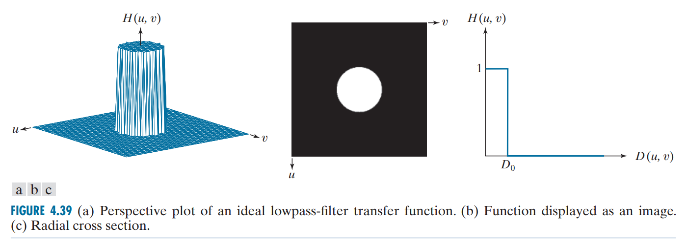

Codes: https://github.com/CassiniHuy/image-low-pass-filters-pytorch

The low-pass filters include ideal, Butterworth, Gaussian filters and implemented by PyTorch. Yes, it's differentiable.

The detailed description as follows:

<!--more-->

### Convert to Frequency Domain 转换到频域

Assume there is an image in spatial domain $f(u, v)\in\mathbb{R}^{m\times n}$, 

and convert it from spatial domain to frequency domain (shifted) $F(u, v)$,

Therefore the low-pass filtering is $H(u,v)\odot F(u, v)$, where $H(u,v)$ is the transfer function from $\mathbb{R}^{m\times n}$ as well.
Finally the filtered image is obtained by inverse FFT (shifted).

```python
def _to_freq(image: Tensor) -> Tensor:
    """Convert from spatial domain to frequency domain.
    Args:
        image (Tensor): [B, C, H, W].
    Returns:
        Tensor: [B, C, H, W]
    """    
    img_fft = torch.fft.fft2(image)
    img_fft_shift = torch.fft.fftshift(img_fft)
    return img_fft_shift

def _to_space(image_fft: Tensor) -> Tensor:
    """Convert from frequency domain to spatial domain.
    Args:
        image_fft (Tensor): [B, C, H, W].
    Returns:
        Tensor: [B, C, H, W].
    """    
    img_ifft_shift = torch.fft.ifftshift(image_fft)
    img_ifft = torch.fft.ifft2(img_ifft_shift)
    img = torch.abs(img_ifft).clamp(0, 1)
    return img
```

NOTE: The fft2 result has to be shifted to ensure the lower frequency components are placed around the center of the matrix. Otherwise, they exist at four corners, which is tricky to handle.

### Ideal 理想低通滤波器

$$
H(u, v)=\begin{cases} 1,\quad D(u, v) \le D_0 \\ 0,\quad D(u, v) > D_0
\end{cases}
$$

where $D(u,v)$ is the distance to the matrix center for each pixel, and $D_0$ is the cutoff frequency.
With a greater $D_0$, more high frequencies are retained and therefore less information lost.



### Gaussian 高斯滤波器

$$
H(u, v)=\exp({-D^2(u, v)/2{D_0}^2})
$$


### Butterworth 布特沃斯滤波器

$$
H(u, v)=\frac{1}{1+[D(u, v)/D_0]^{2n}}
$$

where $n$ is the order of the Butterworth filter.

With a higher $n$, the filter is sharper, which approachs more to the ideal filter; otherwise it approaches to the gaussian filter.


## Usage Example

```python
import torch
from preprocess import ideal_bandpass, butterworth, gaussian

cutoff = 20 # D0

img_tensor = torch.randn((1, 3, 224, 224)) # change it to your image tensor

img_lowpass = ideal_bandpass(img_tensor, cutoff) # lowpass=False for high-pass.

img_lowpass = butterworth(img_tensor, cutoff, 10)

img_lowpass = gaussian(img_tensor, cutoff)
```

## Reference

Gonzalez R C. Digital image processing[M]. Pearson education india, 2009.