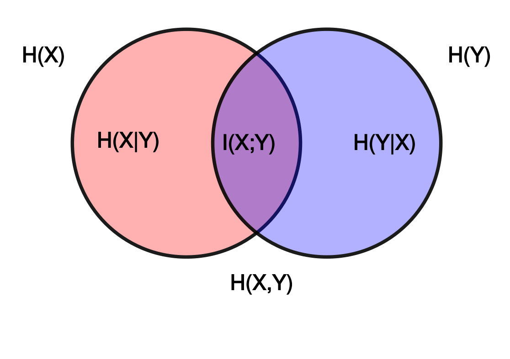
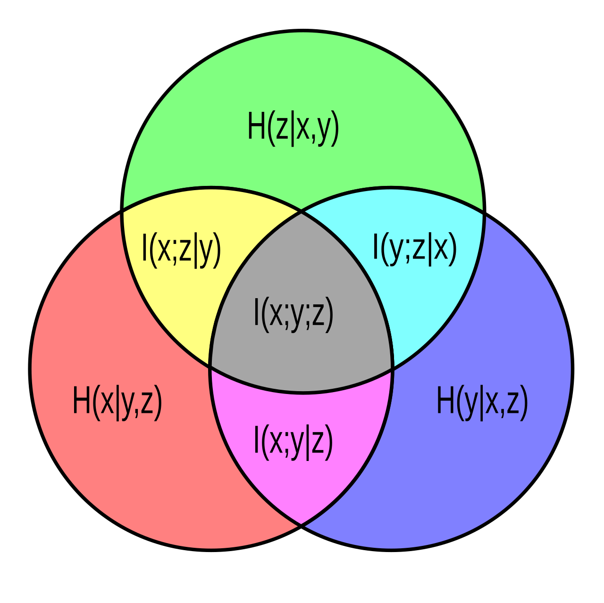

这里梳理了一些关于信息论（Information Theory）的基本知识 (几乎是常识) 的笔记。

Reference: *Cover, Thomas M. Elements of information theory (Chapter 2). John Wiley & Sons, 1999.*

<!--more-->

# Definitions

### 熵（Entropy）

给定一个变量 $X$，取值自$\mathcal{X}$，它的熵被定义为:

$$H(X)=\sum_{x\in\mathcal{X}} p(x) \log\frac{1}{p(x)}=-\sum_{x\in\mathcal{X}} p(x)\log p(x)$$

- 直观理解：可以将$1/p(x)$想象为某种长度度量，出现概率越小的话，需要用来“编码”的“长度”就需要越长。那么熵就是这个变量长度的期望。
- 所以熵越大，不确定性越大。
- 注意到我们约定$0\log0=0$.
- 如果log的底是2，那么熵的单位是bits；如果log的底是e的话，则是nats
- 熵是非负的（注意到$1/p(x)\ge1$）.

关于记号：通常用大写表示随机变量，而小写表示具体某个取值。 

联合分布的熵与边际分布熵的关系：

$$\begin{align*}H(X,Y) &=-\sum p(x,y)\log p(x,y)\\ &=-\sum p(x)p(y\mid x)\log p(x)p(y\mid x)\\ &=-\sum p(x)\log p(x)+\sum p(y\mid x)\log p(y\mid x)\\ &=H(X)+H(Y\mid X)\\ &=H(Y)+H(X\mid Y)\end{align*}$$

### 互信息（Mutual Information）

给定变量$X$的两个不同的分布$p(x)$和$q(x)$，他们之间的相对熵（KL散度）定义为：

$$D(p\mid\mid q)=\sum_{x\in\mathcal{X}} p(x)\log\frac{p(x)}{q(x)}$$

两个变量的互信息则定义为：

$$I(X;Y)=D(p(x,y)\mid\mid p(x)p(y))$$

- 注意到，$I(X;Y)=I(Y;X)$，且$I(X;X)=H(X)$
- 两个变量的互信息是由他们的联合分布决定的

注意到互信息和熵之间的关系：

$$\begin{align*}I(X;Y) &=\sum_{x\in\mathcal{X},y\in\mathcal{Y}}p(x,y)\log\frac{p(x,y)}{p(x)p(y)}\\ &=\sum p(x,y)\log\frac{p(x)p(y\mid x)}{p(x)p(y)}\\ &=\sum p(x,y)\log p(y\mid x)-\sum p(x,y)\log p(y)\\ &=-H(Y\mid X)+H(Y)=-H(X\mid Y)+H(X)\\ &=H(X)+H(Y)-H(X,Y)\end{align*}$$

> 注意到最后一步实际上是全概率公式，即$\sum p(x,y)f(y)=\sum p(y)f(y), \sum p(x,y)f(y\mid x)=\sum p(y\mid x)f(y\mid x)$
> 

# Commonly-used Properties

### Jensen不等式（Jensen Inequality）

回忆一下上凸函数（concave）和下凸函数（convex）的定义，也就是若由两个点$x_1,x_2$，有

$$f(\lambda x_1+(1-\lambda)x_2)\le \lambda f(x_1)+(1-\lambda)f(x_2)$$

上面这个是下凸函数，如果是大于等于，则相反；并且，其中等式成立当且仅当$\lambda$=1或0的情况，称之为严格的下/上凸.

常用的是如下表达，即：

$$Ef(X)=\sum p(x)f(x)\le f(EX)=f(\sum p(x)x)$$

即下凸函数$f$的值的期望是小于等于期望的值的；并且如果$f$是严格的，等式成立说明变量$X$是个常量。

信息论里常用到如下对于log-sum函数的下凸性（convexity）的结论：

$$\sum a_i\log\frac{a_i}{b_i}\ge (\sum a_i \log\frac{\sum a_i}{\sum b_i})$$

其中，$a_i$和$b_i$是非负的数；等式成立当且仅当$a_i/b_i=const$. 对应到概率，可以理解为等式成立当且仅当两个概率分布是相等的。证明见书中定理2.7.1.

> 注意到，如果其中$a_i$和$b_i$是两个关于$t$函数，等式成立说明$a_i/b_i=h(t)$，即某个关于t的函数。
> 

### 熵和互信息的一些性质（由相对熵的性质引出）（Derived Properties）

关于互信息的性质：

- (non-negativity of relative entropy) 相对熵是非负的；
    
    利用log函数的上凸性有：
    
    $$\begin{align*} D(p\mid\mid q) &=\sum p(x)\log\frac{p(x)}{q(x)}\\ &\ge -\log \sum p(x)\frac{q(x)}{p(x)}=0 \end{align*}    $$
    
- (zero relative entropy leads to equality) 如果相对熵等于0，则说明两个分布相同（注意到Jensen不等式相等的条件）。
- (non-negativity of mutual information) 所以，互信息也是非负的。
- (zero mutual information leads to independence) 所以互信息等于0，则说明$p(x,y)=p(x)p(y)$，即两个分布独立

关于熵的性质：

- (maximum of entropy) 熵有一个最大值，即$\log|\mathcal{X}|$；这就是$X$服从均匀分布$u(x)$的情况：
    
    $$\log|\mathcal{X}|-H(X)=\sum p(x)\log \frac{p(x)}{1/log|\mathcal{X}|}=D(p||u)\ge 0.$$
    
- (conditioning never decrease entropy) 添加条件不会降低熵，即$H(X\mid Y)\le H(X)$（很符合直觉，多知道东西怎么会降低“信息量”呢？）:
    
    $$    H(X)-H(X\mid Y)=I(X;Y)\ge 0    $$
    
    > 注意互信息无此结论，因为互信息刻画的是相关性，这会随着已知条件的变化而变化
    > 
- (inequality between joint and marginal entropy) 边际分布的熵之和大于等于联合分布的熵，即$H(X)+H(Y)\ge H(X,Y)$,
    
    $$    H(X)+H(Y)-H(X,Y)=I(X;Y)\ge 0.    $$
    
    并且可以看出，等式成立当且仅当$X$和$Y$独立。
    
- (convexity of relative entropy) 相对熵关于$(p,q)$是下凸的（convex），证明利用log-sum函数的下凸性：
    
    $$    \begin{align*}    \sum D(p_i||q_i)&=\sum_i (\sum_x p_i(x)\log\frac{p_i(x)}{q_i(x)})\\    &\ge \sum_x (\sum_i p_i(x)\log\frac{\sum_i p_i(x)}{\sum_i q_i(x)})=D(\sum p_i||\sum q_i)\\    \end{align*}    $$
    
    > 一定要注意凸性是关于什么成立的。
    > 
- (concavity of entorpy) 根据上面的结论，再结合$H(X)+D(p||u)=\log|\mathcal{X}|$，所以熵是上凸的（concave）。
    
    > (convexity/concavity of mutual information) 互信息并没有如此好的凸性，但若视$p(x,y)=p(x)p(y\mid x)$，则互信息关于前者$p(x)$上凸（固定$p(y\mid x)$），而关于后者p(y\mid x)下凸（固定$p(x)$）。感觉这个结论不是很有用，证明见定理2.7.4。
    > 

> wiki上有两个很直观的图，可以参考（注意$I(X;Y;Z)$可正可负可零）：
> 
>  | 
> ---|---

### 关于条件(conditioning)的影响

关于独立性，需要注意到：

- 边际分布独立和条件独立并无关系，即$X$和$Y$独立，但并不意味着$X$和$Y\mid Z$独立；
- 并且，若$Z$分别与$X$和$Y$独立，也不意味着$Z$和$X\mid Y$独立；除非$Z$是和$(X,Y)$独立。

类似有，添加条件，关于互信息的变化并没什么结论，互信息即可能增大，也可能减少，还可能不变。

添加条件对于互信息的变化，称为交互信息(Interaction Information)，即$I(X;Y;Z)=I(X;Y)-I(X;Y\mid Z)$.

可以直观理解添加条件之后，互信息变化的意义：

- $I(X;Y\mid Z)<I(X;Y)$，即交互信息为正，这说明$Z$某种程度上“排除”了$X$和$Y$之间的关联。直观上可以理解为$Z$与$X$、$Y$中某一个有关联，导致$Z$的出现能够解释其中一个，使得$X$和$Y$之间的依赖性降低。例如发生车祸，关于驾驶员主观故意和车祸之间的关系，发现汽车刹车失灵，那么上面那个例子的关系就减弱了。
- $I(X;Y\mid Z)>I(X;Y)$，即交互信息为负，这说明$Z$某种程度上“支持”了$X$和$Y$之间的关联。直观上可以理解为Z与X和Y有某种共同的关联，导致$Z$成为$X$和$Y$之间有关系的信号。例如，发现有酒味，那么这种关系就增强了。

> 注意到交互信息为零，即$I(X;Y;Z)=0$，并*不能*说明其中一个变量和其余俩独立。
> 

### 数据处理不等式（Data Processing Inequality）

这也是一个极其常用的不等式。

考虑三个变量的关系：$X\to Y\to Z$，若$p(x,y,z)=p(x)p(y\mid x)p(z\mid y)$（即$Z\perp X\mid Y$），则有：

$$I(X;Y)\ge I(X;Z).$$

这个不等式说明数据处理只会“掉”输入的信息，不会“添”输入的信息。

注意到这三个变量之间的关系，是知道了$Z$仅仅需要由$Y$决定，即已知$Y$的情况下，$Z$和$X$独立（马尔科夫链），证明就需要利用这个性质：

$$\begin{align*}I(X;Y,Z)&=H(Y,Z)-H(Y,Z\mid X)\\ &=H(Y)+H(Z\mid Y)-(H(Y\mid X)+H(Z\mid Y, X))\\ &=I(X;Y)+I(Z;X\mid Y)=I(X;Z)+I(Y;X\mid Z).\end{align*}$$

三个变量之间关系说明$I(Z;X\mid Y)=0$，所以:

$$I(X;Y)=I(X;Z)+I(Y;X\mid Z)\ge I(X;Z).$$

这里可以看出，等式成立的条件是$Y\perp X\mid Z$。这有什么实际意义呢？比如Z完全没有丢失Y的信息这种情况，于是知道$Z$就能确定$Y$，于是$Y$当然就和$X$没关系了。

注意到上面的式子，还引出另一个结论，即$I(Y;X\mid Z)=I(X;Y)-I(X;Z)\le I(X;Y)$。这说明条件$Z$只能减弱$X$和$Y$之间的关系，直观上可以理解为因为$Z$能够含有$Y$的信息，使得$Y$和$X$之间的依赖能够降低。

# End

上面总结了一些常用的熵和互信息的基础知识，还有如Fano Inequality等知识没有介绍，需要时可以查阅原书。

