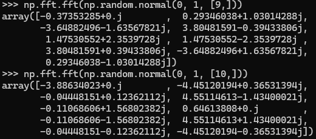

I am going to give a quick explanation for DFT (Discrete Fourier Transform) from the viewpoint of DFT computation itself. 

<!--more-->

# Observation

For example, here we use [*numpy.fft.fft*](https://numpy.org/doc/stable/reference/generated/numpy.fft.fft.html) for some random vectors:

Let’s denote the input as $x_0,x_1,\cdots,x_{n-1}$, and the output as $y_0,y_2,\cdots,y_{n-1}$. 

We can observe something about the result from *fft*:

- While most entries are complex numbers, the first entry $y_0$ is always a real number (i.e., the imaginary part is zero).
- Moreover, when the vector length $n$ is even, the $y_{n/2}$ is also a real number.
- $y_t$ and $y_{n-t}$ are conjugates of each other, for $1\le t \le n-1$.

# Understanding

### DFT as Matrix-vector  multiplication

Instead of telling a long story of DSP theory, let’s get an intuitive understanding directly from the computation process. 

This is how *fft* computes $y_0,\cdots,y_{n-1}$ from $x_0,\cdots,x_{n-1}$:

$$\begin{bmatrix} y_0\\ y_1\\ \vdots\\ y_{n-1} \end{bmatrix} = F\cdot \begin{bmatrix} x_0\\ x_1\\ \vdots\\ x_{n-1} \end{bmatrix}\\ \text{where}\;F=\begin{bmatrix} \omega^{0\times 0} & \omega^{1\times 0} & \omega^{2\times 0} & \cdots & \omega^{(n-1)\times 0} \\ \omega^{0\times 1} & \omega^{1\times 1} & \omega^{2\times 1} & \cdots & \omega^{(n-1)\times 1} \\ \vdots & \vdots & \vdots & \ddots & \vdots \\ \omega^{0\times (n-1)} & \omega^{1\times (n-1)} & \omega^{2\times (n-1)} & \cdots & \omega^{(n-1)\times (n-1)} \\ \end{bmatrix}\\ \omega^k=e^{-2\pi ik/n}$$

The matrix $F$ is called the [*Fourier matrix*](https://en.wikipedia.org/wiki/DFT_matrix).

Essentially, ignoring the acceleration techniques, the *fft* can be viewed as a matrix-vector multiplication, where each $y_s$ is a weighted sum of the $s$ th row vector using the 'weights' $x_0, \cdots, x_{n-1}$.

$$y_s=\sum_t x_t\omega^{t\times s}=\sum_t x_t(e^{-2\pi si/n})^t$$

Let’s take a close look on these entries for a given row vector of matrix $F$.

### Symmetries

The $s$ th row vector of $F$ can be written as:

$$\begin{bmatrix}h_s(\frac{0}{n}) & h_s(\frac{1}{n}) & h_s(\frac{2}{n}) & \cdots & h_s(\frac{n-1}{n}) \\ \end{bmatrix}\;\text{where}\; h_s(x)=e^{-2\pi x\cdot si}$$

Therefore, this vector can be seen as $n$ sampling points in one period (i.e., $1/s$) of the periodic function $h_s$. 

In other words, the entries of $s$ th row vector is sampling points of frequency $s$ Hz. Respectively, the corresponding value $y_s$ is considered the $s$ Hz component of the original signal. For example, for the first row ($s$=0), the frequency is zero and $y_0$ is simply the sum of $x_0,\cdots,x_{n-1}$. For the second row ($s=1$), $h_s$ is of period $2\pi$ and $y_1$ is input signal’s 1 Hz component. 

Now let’s explain the above three observations by analyzing each row’s entries $(e^{-2\pi si/n})^t$: 

- For the first row, i.e., the frequency *s=0,*
    
    $$(e^{-2\pi si/n})^t=(e^{-2\pi ti/n})^s=(e^{-2\pi ti/n})^0=1$$
    
    So the first row vector’s entries are free of imaginary parts, $y_0$ is definitely a real number.
    
- Additionally, when *n* is even, for frequency $s=n/2$
    
    $$(e^{-2\pi si/n})^t=(e^{-\pi i})^t=(e^{\pi i})^{-t}=(-1)^{-t}$$
    
    So these entries are also real numbers. Then, as a weighted sum of these entries, $y_{n/2}$ is definitely an real number.
    
- Moreover, we can observe that, for a $n-s$ th row’s entry:
    
    $$(e^{-2\pi (n-s)i/n})^t=(e^{2\pi si/n})^t=\overline{(\overline{e^{2\pi si/n}})^t}=\overline{(e^{-2\pi si/n})^t}$$
    
    It means the entries of $s$ th row vector and $n-s$ th row vector are conjugates of each other respectively. Therefore, $y_s$ and $y_{n-s}$ are also conjugates of each other, as they are linear combinations of these entries by the same weights. 
    
    This implies that, given an input vector of $n$ entries, we can only obtain $\lfloor n/2\rfloor +1$ useful output values (see Nyquist sampling theorem). So, from the $s=\lfloor n/2\rfloor+2$ th output value, negative frequencies, i.e., $-(n-s)$ Hz is used to call these output values. For example, given a vector length of 10, the output values are of frequencies 0 Hz, 1 Hz, 2 Hz, 3 Hz, 4 Hz, 5 Hz/-5 Hz, -4 Hz, -3Hz, -2 Hz, -1 Hz.
    
    So, after *fft*, if you want to shift the lower frequency components into the center, you use *fftshift* method to alter the output values’ positions into an order (-5 Hz) -4 Hz, -3 Hz, -2 Hz, -1 Hz, 0 Hz, 1 Hz, 2 Hz, 3Hz, 4 Hz, (5 Hz).
    
    
    
    Note that *numpy.fft.fftshift* regards the $\lfloor n/2\rfloor+1$ th output value as a part of negative frequencies.
