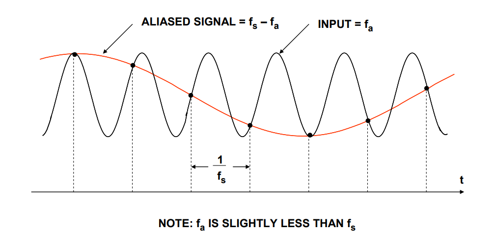
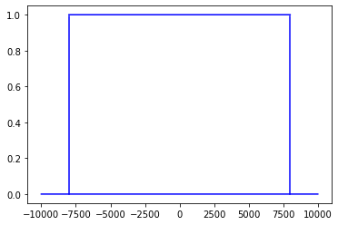

混叠现象发生的细节

<!--more-->

## Nyquist theorem

由于[奈奎斯特定理](https://en.wikipedia.org/wiki/Nyquist%E2%80%93Shannon_sampling_theorem)，若音频的采样率为$f_s$，音频的频带范围被限制为0~$f_s/2$ Hz。频率超过$f_s/2$的信号将会丢失被发生混叠。

## Aliasing phenomenon

如果有一个信号频率为$f_a$，采样的时候使用采样率$f_s$，并且$f_s<2f_a$. 

最后得到的信号频率为$f_s-f_a$ Hz，小于$f_a$.

这就是混叠现象。

例如使用10000hz的采样率采样4000hz的信号，得到6000hz的信号。

因此，降采样时，必须先通过低通滤波器。例如，降采样到16000hz，需要通过8000hz滤波器。

细节参考：
[Theory of Ideal Bandlimited Interpolation](https://ccrma.stanford.edu/~jos/resample/Theory_Ideal_Bandlimited_Interpolation.html)

## Sinc functions of finite zero-crossings

下面的是理想的低通滤波器，8000hz。

理想的sinc函数有无限个零点，实际使用的时候，使用近似版，即有限个零点，通过规定零点个数来确定近似的精度。

细节如下：

[From Theory to Practice](https://ccrma.stanford.edu/~jos/resample/Theory_Practice.html)

下面看看混叠到底如何发生。

橙色线为8000hz位置，下面是原点左右各8个零点的近似滤波器（kaiser窗）。

8000-10000hz混叠到6000-8000hz。

下面是左右大概40个零点。

混叠现象发生在7500-8000.

*[librosa](https://librosa.org/doc/latest/index.html)*默认参数为['kaiser_best'](https://librosa.org/doc/latest/generated/librosa.resample.html?highlight=resample#librosa.resample)，即[64 zero-crossings](https://github.com/bmcfee/resampy/blob/ccb85575403663e17697bcde8e25765b022a9e0f/resampy/filters.py/).

Kaldi [suggests around 4 to 10 for normal use](https://github.com/kaldi-asr/kaldi/blob/cbed4ff688a172a7f765493d24771c1bd57dcd20/src/feat/resample.h#L154).

## Experiment

控制扰动的SNR为20db，然后最大化输出的MFCC差异，使用的重采样函数为[resampling function](https://pytorch.org/audio/stable/compliance.kaldi.html?highlight=resample#torchaudio.compliance.kaldi.resample_waveform).

原音频：

[nonideal_lowpass_filter/911.wav](nonideal_lowpass_filter/911.wav)

输入音频（生成的）：

[nonideal_lowpass_filter/attack_filter_width4.wav](nonideal_lowpass_filter/attack_filter_width4.wav)

输出音频：

[nonideal_lowpass_filter/attack_output_filter_width4.wav](nonideal_lowpass_filter/attack_output_filter_width4.wav)

使用4个零点（左右各4个），改变只在6000-8000hz

