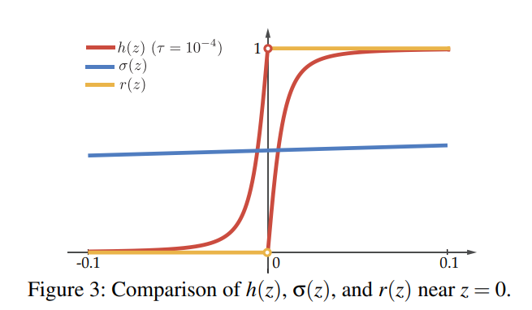

论文[Interpretable Deep Learning under Fire (Usenix Security 2020)](https://www.usenix.org/system/files/sec20-zhang-xinyang.pdf)中关于ReLU高阶导为零的处理方法，及其PyTorch实现。

<!--more-->

## ReLU高阶导问题

ReLU高阶导为零，这使得神经网络为分段线性函数，见[『ReLU神经网络：分段线性』](http://weichengan.com/2021/01/07/suibi/piecewise_linear/)。

在某些情况下，需要使用高阶导更新参数。

## 逼近ReLU函数

使用如下函数逼近ReLU函数：

$$ReLU_{Approx} = \begin{cases}  
z+\sqrt{z^2+\tau} & z < 0 \\
\sqrt{z^2+\tau} & z > 0
\end{cases}$$

$\tau$为常数，例如可取$0.0005$，越小越逼近ReLU。

其导函数如下：



橘红色为原ReLU的一阶导，红色为$ReLU_{Approx}$的一阶导，$ReLU_{Approx}$具有二阶导。

## PyTorch实现

继承*autograd.Function*对象，不改变前向传播，只改变反向传播的梯度：

```python
import torch
from torch import nn

class SmoothGradReLU(torch.autograd.Function):
    @staticmethod
    def forward(ctx, input_, tau):
        ctx.save_for_backward(input_, tau)
        output = input_.clamp(min=0)
        return output
    @staticmethod
    def backward(ctx, grad_output):
        input_, tau = ctx.saved_tensors
        mask = input_.clone()
        mask.pow_(2)
        mask.add_(tau)
        mask.pow_(0.5)
        mask = input_ / mask
        mask[input_ < 0] += 1
        output = mask * grad_output
        del mask
        return output, None


def smooth_grad_modules(model: 'module sequence', x: torch.Tensor, tau: float = 0.0005) -> torch.Tensor:
    for module in model:
        if 'relu' in str(module).lower():
            x = SmoothGradReLU.apply(x, torch.tensor(tau))
        elif "avgpool" in str(module).lower():
            x = module(x)
            x = x.view(x.size(0),-1)
        else:
            x = module(x)
    return x
```

## 总结

- 一种光滑处理ReLU的方法；
- autograd.Function类。

