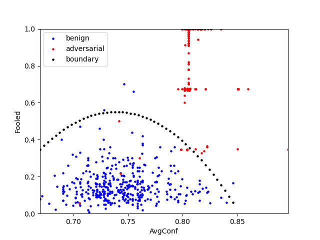

SentiNet ([link](https://arxiv.org/abs/1812.00292)) PyTorch implementation(**NOTE: Unofficial**): Github repo: https://github.com/CassiniHuy/trojan-attacks-and-defenses

Feel free to point out possible implementation errors.

<!--more-->

## How SentiNet works?

[SentiNet](https://arxiv.org/abs/1812.00292) tries to locate the localized adversarial patches (including backdoor triggers) using GradCAM. It aims to extract these impactful patches from adversarial images and overlays them on some benign test images. So:

- If the extracted patches are malicious, they can mislead the model on these benign images.
- If the extracted patches are benign, they cannot probably mislead the model.

Therefore, SentiNet tries to differentiate benign and adversarial examples by their different distributions on the above behavious. The paper gives easy-to-understand details and you can refer to it: [https://arxiv.org/abs/1812.00292](https://arxiv.org/abs/1812.00292)

## Code Usage

### A example about how to run

```python
import torch, os
from timm import create_model
from defense import SentiNet
from logging import DEBUG, INFO, Logger
from torchvision.transforms import Resize, Normalize

logger = define_your_logger_here # Logger from module logging

# * load model
model: torch.nn.Module = get_your_pytorch_model_here # e.g., using timm.create_model
model.load_state_dict(torch.load(your_checkpoint_path))
layer = the_layer_of_your_pytorch_model # e.g., for resnet18, it can be: layer = model.layer4[1].conv2

# * load imgs
benign_imgs = your_benign_image_paths # It looks like ['path/to/image1.png', 'path/to/image2.png', ...]
test_imgs = your_test_image_paths
adv_imgs = your_adv_image_paths

# * run sentinet
normalize = Normalize(the_mean_your_model_required, the_std_your_model_required) # e.g., [0.485, 0.456, 0.406], [0.229, 0.224, 0.225]
resize = Resize(the_input_size_your_model_required)
transform = lambda x: normalize(resize(x))
sentinet = SentiNet(
    model, layer, the_input_size_your_model_required, transform, 
    benign_imgs, test_imgs, adv_imgs, 
    log_path='logs/sentinet', logger=logger)

sentinet.detect() # including training, testing and logging. It returns a dict containing the results.
```

### Configuration:

You can find the config class in the file *defense/sentinet.py*:

```python
GAUSSIAN_NOISE = 1
CHECKER_PATTERN = 2

@dataclass
class SentiNetConfig(DefenseConfig):
    """Default SentiNet Config.
    """    
    benign_img_num: int = 400 # Max benign image used for training
    test_img_num: int = 100 # Max test benign images used for testing
    adv_img_num: int = 400 # Max adv images used

    enable_class_proposal: bool = True # Use alg1, the class proposal 
    batch_size: int = 100 # batch size for cuda paralleling
    selective_search_scale: int = 500  # refer to https://github.com/AlpacaTechJP/selectivesearch
    selective_search_sigma: float = .9 # refer to https://github.com/AlpacaTechJP/selectivesearch
    selective_search_minsize: int = 10 # refer to https://github.com/AlpacaTechJP/selectivesearch
    selective_search_max_regions: int = 100 # max region proposals considered for each image
    class_proposal_k: int = 2 # max class proposal num

    mask_threshold: float = .15      # percent of masks retained when binarize
    inert_type: int = GAUSSIAN_NOISE # insert type, or CHECKER_PATTERN 
    inert_noise_mean: float = .0
    inert_noise_std: float = 1.0
    inert_checker_bins: int = 15 # how may bins in the checker pattern

    x_interval_size: float = .02 # used to select outpts, refer to the code
```

### Output

The ***sentinet.detect*** method will output 3 files (see *samples/sentinet*) and 2 files containing the results: *sentinet-results.json* and *sentinet-results.png*. The *sentinet-results.json* containing all detailed results such as the curve function weights, training/testing points. The *sentinet-results.png* plots the curve and benign/adv points. It looks like the following example (running for the badnets attack.):



